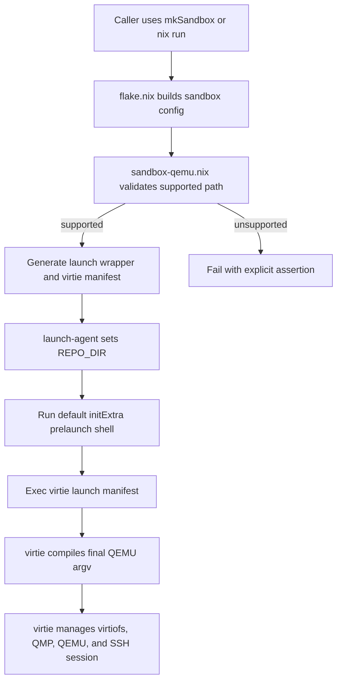

# Agentspace Sandbox Launcher

Nix-managed sandbox launch workflow for the currently supported `virtie` path.

**Status**: In-Progress

## Goals

Keep `mkSandbox` as the stable entrypoint for constructing the sandbox system and host-side launch helpers.

- Support a single active host launch path: `virtiofs + ssh + qemu`, foreground-only, through `virtie`.
- Generate a Nix-owned launch wrapper and manifest that contain the inputs required by `virtie`.
- Reject unsupported launch configurations explicitly instead of falling back to legacy orchestration.
- Preserve downstream extension hooks that are still part of the supported surface, especially `extraModules` and `homeModules`.

Out of scope:

- `connectWith = "console"`
- `protocol = "9p"`
- airlock-enabled launch flows
- reconnect support
- general `agentspace.sandbox.initExtra` customization beyond the current default prelude
- restoring `systemd-run`, `supervisord`, or `microvm-run` as active launch orchestration

Acceptance criteria:

- [x] `mkLaunch` execs `virtie launch <manifest> -- "$@"` for the supported path.
- [x] The manifest emitted from `sandbox-qemu.nix` carries the current `virtie` inputs: working dir, lock path, ssh argv/user, typed QEMU settings, volumes, and `virtiofs` daemon commands.
- [x] Unsupported launch configurations fail through explicit assertions rather than hidden fallback behavior.
- [x] `agentspace.sandbox.extraModules` remains usable through the follow-up evaluation pass in `mkSandbox`.
- [ ] The default `mkSandbox {}` launch experience provisions a usable out-of-the-box SSH credential story.
- [ ] Repo-level flake outputs and enabled checks validate the documented path end to end.

## Progress

- [x] Package `virtie` in the flake and use it from generated launch wrappers.
- [x] Replace the active launch path with `virtie launch` instead of legacy host orchestration.
- [x] Move final QEMU argv construction out of Nix and into `virtie`, leaving Nix responsible for guest evaluation plus the resolved typed QEMU launch config.
- [x] Emit the typed QEMU manifest from `sandbox-qemu.nix` through `agentspace-qemu-config.nix`.
- [x] Generate per-share `virtiofsd` commands and socket paths in the manifest instead of relying on a `virtiofsd-run` helper.
- [x] Stub `connect-agent` with an explicit unsupported message while launch-time CID allocation remains dynamic.
- [x] Restore `agentspace.sandbox.extraModules` support via the `mkSandbox` extension pass.
- [x] Keep unsupported modes explicit in `sandbox-qemu.nix`, including `9p`, console attach, airlock, fixed vsock CID, and other unsupported direct-QEMU features.
- [x] Remove the legacy Nix argv-template builder so the repo does not imply that final QEMU argv is still Nix-owned.
- [x] Re-enable the `virtie` fake-tools E2E check in `checks/default.nix` alongside the manifest contract check.
- [ ] Fix `nix flake check`, which currently stops at `packages.x86_64-linux.default` because it is a string path rather than a derivation.
- [ ] Re-enable the additional repo checks that exist in `checks/` but are currently commented out in `checks/default.nix`.
- [ ] Decide whether `connect-agent` should remain unsupported or be replaced by a future `virtie` reconnect/connect command.

## Appendix

- Current supported selection rule: `agentspace.sandbox.connectWith == "ssh"`, `agentspace.sandbox.protocol == "virtiofs"`, airlock disabled, default `initExtra`, QEMU hypervisor, user-mode networking.
- Current launcher shape: set `REPO_DIR`, run the default prelaunch shell, then exec `virtie launch`.
- Current Nix-to-virtie contract:
  - Nix still owns guest evaluation and image production through `microvm.nix`.
  - Nix resolves machine, CPU, memory, kernel, block, network, `virtiofs`, and QMP settings into the manifest.
  - `virtie` owns final argv compilation, QMP lifecycle, process launch, and teardown ordering.
- Current repo drift to keep visible in planning:
  - `mkConnect` is no longer a direct SSH wrapper; it now exits unsupported.
  - `checks/default.nix` now enables the `virtie` contract and fake-tools E2E checks, but unsupported-path, home-manager, extra-modules, and connect checks are still commented out.

