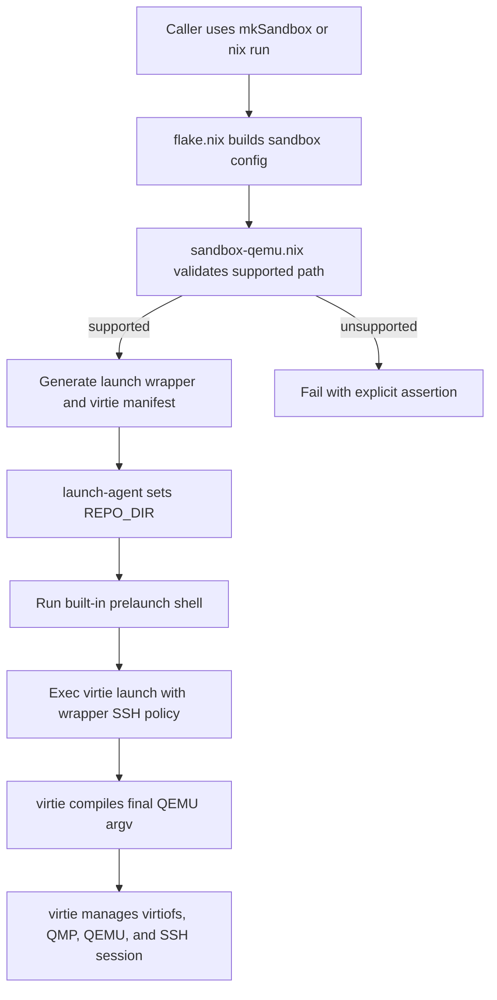

# Agentspace Sandbox Launcher

Nix-managed sandbox launch workflow for the currently supported `virtie` path.

**Status**: In-Progress

## Goals

Keep `mkSandbox` as the stable entrypoint for constructing the sandbox system and host-side launch helpers.

- Support a single active host launch path: `virtiofs + ssh + qemu`, foreground-only, through `virtie`.
- Generate a Nix-owned launch wrapper and manifest that contain the inputs required by `virtie`.
- Keep the public Nix surface focused on launch-shape choices, including whether the virtio-balloon device is enabled, while leaving runtime balloon policy defaults to `virtie`.
- Reject unsupported launch configurations explicitly instead of falling back to legacy orchestration.
- Preserve downstream extension hooks that are still part of the supported surface, especially `extraModules` and `homeModules`.

Out of scope:

- reconnect support
- alternate launch flows beyond the built-in `virtiofs + ssh + qemu` path
- general launch-script customization beyond the built-in prelaunch shell
- restoring `systemd-run`, `supervisord`, or `microvm-run` as active launch orchestration

Acceptance criteria:

- [x] `mkLaunch` execs `virtie launch -v --ssh --manifest=MANIFEST -- "$@"` for autoconnecting SSH sessions and `virtie launch -v --manifest=MANIFEST` when SSH autoconnect is disabled.
- [x] `mkSandbox` keeps the supported customization hooks required by downstream consumers, especially `extraModules`, `homeModules`, SSH credentials, workspace settings, and persistence settings.
- [x] The manifest emitted from `sandbox-qemu.nix` carries the current `virtie` inputs: working dir, lock path, ssh argv/user, typed QEMU settings, volumes, and `virtiofs` daemon commands.
- [x] Unsupported launch configurations fail through explicit assertions rather than hidden fallback behavior.
- [x] `agentspace.sandbox.extraModules` remains usable through the follow-up evaluation pass in `mkSandbox`.
- [ ] The default `mkSandbox {}` launch experience provisions a usable out-of-the-box SSH credential story.
- [x] Repo-level flake outputs and enabled checks validate the documented path end to end.

## Progress

- [x] Package `virtie` in the flake and use it from generated launch wrappers.
- [x] Replace the active launch path with `virtie launch` instead of legacy host orchestration.
- [x] Move final QEMU argv construction out of Nix and into `virtie`, leaving Nix responsible for guest evaluation plus the resolved typed QEMU launch config.
- [x] Emit the typed QEMU manifest from `sandbox-qemu.nix` through `agentspace-qemu-config.nix`.
- [x] Reduce the public balloon surface to `agentspace.sandbox.balloon`, with `virtie` supplying runtime balloon-control defaults when the device is enabled.
- [x] Generate per-share `virtiofsd` commands and socket paths in the manifest instead of relying on a `virtiofsd-run` helper.
- [x] Opt the generated manifest into XDG runtime socket placement so default `virtiofs` and QMP sockets no longer spill into the launch working directory.
- [x] Remove `mkConnect`, `connect-agent`, and `apps.connect` so the repo exposes only the supported launch entrypoint.
- [x] Remove the dead airlock and bundle/import workflow files so the repo matches the supported launch surface.
- [x] Restore `agentspace.sandbox.extraModules` support via the `mkSandbox` extension pass.
- [x] Reduce the public `agentspace.sandbox` API to the supported launch knobs while keeping guardrail assertions for incompatible lower-level `microvm` overrides.
- [x] Remove the legacy Nix argv-template builder so the repo does not imply that final QEMU argv is still Nix-owned.
- [x] Keep the launch-contract and `virtie` fake-tools E2E checks enabled in `checks/default.nix`, alongside retained-hook checks for `extraModules`, `homeModules`, and a downstream-style consumer config.
- [x] Fix `nix flake check` evaluation by removing broken non-derivation package shims.

## Appendix

- Current supported selection rule: built-in SSH attach, built-in `virtiofs` shares, QEMU hypervisor, dynamic vsock allocation, and user-mode networking.
- Current launcher shape: set `REPO_DIR`, run the default prelaunch shell, then exec `virtie launch -v` with `--ssh` when `agentspace.sandbox.ssh.autoconnect` is true or wrapper args are supplied.
- Current Nix-to-virtie contract:
  - Nix still owns guest evaluation and image production through `microvm.nix`.
  - Nix resolves machine, CPU, memory, kernel, block, network, `virtiofs`, and QMP settings into the manifest.
  - Nix exposes only `agentspace.sandbox.balloon` for enabling or disabling the virtio-balloon device.
  - Nix exposes `agentspace.sandbox.notifications` for an optional host-side shell notification command and state allowlist.
  - When enabled, the generated manifest includes the balloon device but leaves controller defaults to `virtie`.
  - The generated manifest sets `paths.runtimeDir = ""`, so relative socket paths resolve under the per-user XDG runtime directory by default.
  - `virtie` owns final argv compilation, the long-lived QMP lifecycle, optional runtime balloon control, process launch, and teardown ordering.
- Current retained public hooks:
  - `extraModules`
  - `homeModules`
  - `ssh.authorizedKeys`
  - `ssh.identityFile`
  - `ssh.command`
  - `ssh.autoconnect`
  - `mountWorkspace`, `workspaceMountPoint`
  - `persistence.*`
  - `user`, `hostName`, `swapSize`
  - optional `balloon`
  - optional `notifications.command` shell string and `notifications.states`

