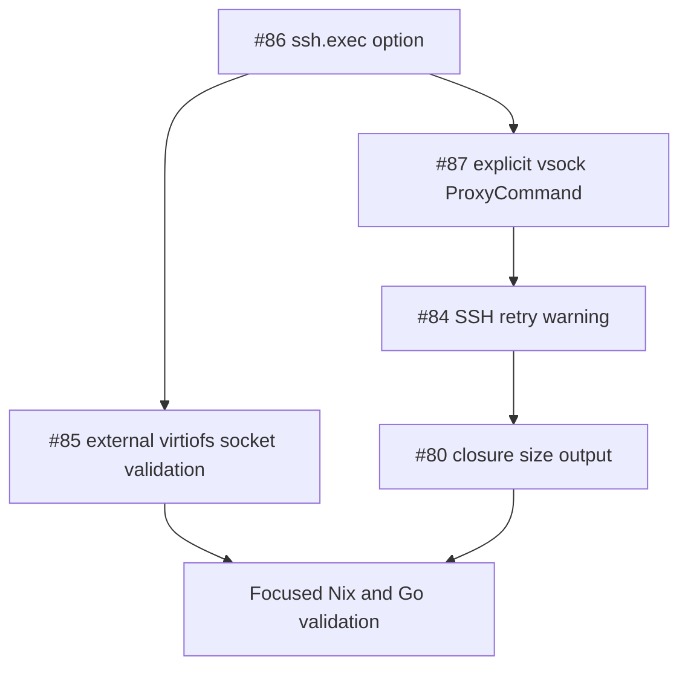

# Sprint 0001: Launch Preflight and SSH Startup Polish

Review the autocoding-ready issue queue and select a coherent first sprint bundle.

**Status**: In-Progress

## Goals

Bundle a small set of issues that improve the default sandbox launch experience without mixing in larger feature surfaces.

- Make generated SSH configuration explicit, configurable, and easier to diagnose.
- Fail earlier with useful errors for externally provided Nix store virtiofs sockets.
- Print useful launch-time size information before the VM starts.
- Keep the sprint scoped to startup and preflight behavior across `sandbox-qemu.nix`, `virtie`, and the existing checks.

Out of scope:

- Broad manifest command-template refactors.
- Workspace mount model changes.
- New host-to-guest tunnel APIs.
- `writeFiles` bidirectional sync or symlink semantics.
- General Go style cleanup not required by the selected fixes.
- Changing the supported launch architecture documented in `.specs/agentspace.md` and `.specs/virtie.md`.

Acceptance criteria:

- [x] `agentspace.sandbox.ssh.exec` exists, defaults to the generated OpenSSH argv, and can be overridden by consumers.
- [x] The default generated SSH argv includes an explicit `systemd-ssh-proxy` `ProxyCommand` for vsock hosts, plus fd-pass and host-key-checking options that do not depend on host SSH config.
- [x] Invalid `agentspace.sandbox.nixStoreShareSocket` values produce a useful Nix-side assertion or launch-time error before QEMU is started.
- [x] `virtie` validates externally supplied `mounts[].virtiofsd_socket` paths when no managed `mounts[].virtiofsd_exec` is present.
- [x] SSH retry failures emit a warning after 5 failed attempts with enough credential guidance for a user to act.
- [ ] The generated launch wrapper prints mkSandbox closure size stats during startup.
- [ ] Focused Nix and Go tests cover the new behavior, and the relevant default checks still pass.

## Progress

- [x] Reviewed the open `good for autocoding` issue list from GitHub.
- [x] Compared each issue against the current specs and code surfaces.
- [x] Selected a coherent first sprint bundle.
- [ ] Implement the selected issues.
- [ ] Update documentation or migration notes if the public consumer API changes.
- [ ] Run validation and remove any `./result` symlinks created by Nix builds.
- [x] Completed [#86](https://github.com/shazow/agentspace/issues/86): added `agentspace.sandbox.ssh.exec` override support.
- [x] Completed [#87](https://github.com/shazow/agentspace/issues/87): default SSH exec now includes explicit vsock proxy options.
- [x] Completed [#85](https://github.com/shazow/agentspace/issues/85): external Nix store virtiofs sockets now fail preflight when invalid.
- [x] Completed [#84](https://github.com/shazow/agentspace/issues/84): SSH retry failures now warn after five failed attempts.

## Issue Review

Recommended for this sprint:

- [#86](https://github.com/shazow/agentspace/issues/86) `agentspace: Make the sshBaseArgv configurable via ssh.exec`
  - Fit: Directly touches `sandbox-qemu.nix` and the generated manifest SSH contract.
  - Reason to include: It creates the consumer override surface needed before changing the default SSH argv in `#87`.
  - Expected work: Add `agentspace.sandbox.ssh.exec` as a nullable or list option, default it from the current generated argv, and update manifest checks.

- [#87](https://github.com/shazow/agentspace/issues/87) `agentspace: Explicitly add ProxyCommand for vsock`
  - Fit: Same code path as `#86`.
  - Reason to include: The current defaults assume host SSH config may provide vsock proxying; the generated wrapper should be self-contained.
  - Expected work: Add `-o ProxyCommand=${pkgs.systemd}/lib/systemd/systemd-ssh-proxy %h %p`, `-o ProxyUseFdpass=yes`, `-o CheckHostIP=no`, and retain ephemeral host-key behavior in the default SSH exec.

- [#85](https://github.com/shazow/agentspace/issues/85) `agentspace: Assert that nixStoreShareSocket exists if set`
  - Fit: Launch preflight and manifest validation.
  - Reason to include: It improves early error quality for an existing startup knob.
  - Expected work: Add Nix assertion for configured external store socket where Nix can check it, and add `virtie` manifest/preflight validation that an external virtiofs socket exists when no managed daemon command is present.

- [#84](https://github.com/shazow/agentspace/issues/84) `virtie: ssh.exec should print warning logs when retry fails`
  - Fit: SSH startup diagnostics.
  - Reason to include: It makes failures introduced by custom or missing SSH configuration easier to understand.
  - Expected work: Track failed SSH attempts in `runSSHSession` retry handling and warn after the fifth failure with credential-focused guidance.

- [#80](https://github.com/shazow/agentspace/issues/80) `agentspace: Print mkSandbox closure size during start`
  - Fit: Launch wrapper startup diagnostics.
  - Reason to include: Small, user-visible launch-time feedback that belongs beside the other preflight polish.
  - Expected work: Add closure size reporting to the generated launch script, likely using Nix tooling already available from the flake context.

Deferred bundles:

- Exec normalization: [#83](https://github.com/shazow/agentspace/issues/83)
  - Reason to defer: It is a cross-cutting Go refactor for all manifest exec fields. It should be designed and tested as its own sprint so it does not destabilize the narrower SSH/preflight work.

- Workspace and host socket workflows: [#74](https://github.com/shazow/agentspace/issues/74), [#73](https://github.com/shazow/agentspace/issues/73)
  - Reason to defer: These both reshape host/guest mount semantics and likely need a dedicated migration plan for consumer-facing Nix options.

- `writeFiles` lifecycle: [#78](https://github.com/shazow/agentspace/issues/78), [#72](https://github.com/shazow/agentspace/issues/72)
  - Reason to defer: These share the same manifest section and guest-agent lifecycle, so they should be bundled together after startup polish.

- Lower-priority cleanup and optional behavior: [#81](https://github.com/shazow/agentspace/issues/81), [#71](https://github.com/shazow/agentspace/issues/71)
  - Reason to defer: `#81` is marked maybe/someday and may need API design. `#71` is broad style cleanup and should be done opportunistically around concrete changes.

## Sprint Plan

1. Add the `ssh.exec` consumer API.
   - Introduce the option in `sandbox-qemu.nix`.
   - Preserve the current default behavior when unset.
   - Update checks that inspect generated `manifest.ssh.exec`.
   - Document the API change in `MIGRATION.md` if the visible option surface changes enough to matter.

2. Make default SSH vsock proxying explicit.
   - Extend the default SSH argv with `systemd-ssh-proxy` options.
   - Keep identity-file injection compatible with `ssh.exec`.
   - Ensure default manifests no longer depend on user-level SSH config for `user@vsock/<cid>` connections.

3. Improve external Nix store socket validation.
   - Add an assertion or preflight check for `nixStoreShareSocket` when configured.
   - Add `virtie` validation for mounts that provide `virtiofsd_socket` without `virtiofsd_exec`.
   - Cover both Nix-generated and direct manifest inputs.

4. Add SSH retry warning diagnostics.
   - Count retry attempts around transient SSH failures.
   - Log a warning after 5 failed attempts with guidance to check `ssh.authorizedKeys`, `ssh.identityFile`, and custom `ssh.exec`.
   - Add Go coverage in the existing manager or SSH retry tests.

5. Print closure size during launch.
   - Add startup output to the generated launch wrapper before `virtie launch`.
   - Keep the command best-effort if size calculation fails, unless the implementation can make failure clearly actionable.
   - Add a focused check that the wrapper includes or emits the expected command.

6. Validate the sprint as a unit.
   - Run `go test ./...` under `virtie`.
   - Run focused Nix checks that cover manifest generation and consumer workflow.
   - Run broader `nix flake check` only if the focused checks pass and runtime cost is acceptable.
   - Unlink any generated `./result` symlinks after Nix builds.

## Appendix

Suggested implementation order:

Risk notes:

- `ssh.exec` needs careful semantics: users who override the whole argv may still need identity-file behavior, or the option documentation should clearly say the override is complete.
- Nix cannot always prove runtime socket existence if the path is produced shortly before launch. The user-facing assertion should avoid blocking legitimate dynamic socket workflows unless the configured path is expected to exist at evaluation time.
- Closure size reporting may force additional Nix store queries at launch time. Keep it fast and local.
- `#83` may later replace ad hoc exec handling; keep this sprint's SSH changes simple enough to survive that refactor.
