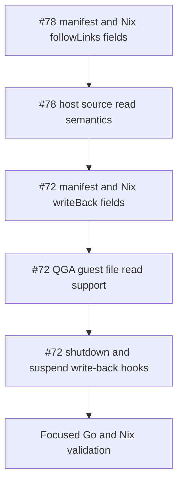

# Sprint 0002: writeFiles Durability

Review the autocoding-ready issue queue and select a coherent second sprint bundle.

**Status**: In-Progress

## Goals

Bundle the remaining `writeFiles` work into a focused sprint that improves host-to-guest file handling without changing workspace or tunnel semantics.

- Add explicit symlink-following behavior for host source files.
- Add optional guest-to-host write-back on shutdown and suspend.
- Keep the manifest and Nix option shape easy to reason about for direct manifest producers and `mkSandbox` users.
- Validate the lifecycle with focused Go tests and generated-manifest checks.

Out of scope:

- General manifest exec-template normalization.
- New host tunnel or socket-sharing APIs.
- Workspace/CWD mount revamp.
- Broad nil-pointer refactors beyond fields touched by `writeFiles`.
- virtiofsd warning/default tuning.
- Closing already implemented sprint 0001 issues upstream.

Acceptance criteria:

- [x] `agentspace.sandbox.writeFiles.*.followLinks` exists, defaults to `true`, and lowers into the `write_files[]` manifest.
- [x] Direct manifests accept `write_files[].follow_links`, defaulting to `true`.
- [x] Host source reads preserve current behavior by default and can opt out of following symlinks.
- [ ] `agentspace.sandbox.writeFiles.*.writeBack` exists, defaults to `false`, and lowers into the `write_files[]` manifest.
- [ ] Direct manifests accept `write_files[].write_back`, defaulting to `false`.
- [ ] `writeBack` requires a host source path and writes guest file contents back to that host path on shutdown and suspend.
- [ ] Write-back errors are stage-aware and do not silently corrupt host files.
- [ ] Focused Go and Nix checks cover manifest validation, Nix lowering, host-source symlink behavior, shutdown write-back, and suspend write-back.

## Progress

- [x] Reviewed the open `good for autocoding` issue list from GitHub.
- [x] Compared each issue against current local sprint 0001 changes and code surfaces.
- [x] Selected a coherent second sprint bundle.
- [x] Implemented `#78` followLinks manifest/Nix fields and symlink read behavior.
- [ ] Implement the selected issues.
- [ ] Update `MIGRATION.md` for the public Nix and direct manifest fields.
- [ ] Run validation and remove any `./result` symlinks created by Nix builds.

## Issue Review

Already handled locally in sprint 0001, but still open in the filtered GitHub view:

- [#86](https://github.com/shazow/agentspace/issues/86) `agentspace: Make the sshBaseArgv configurable via ssh.exec`
- [#87](https://github.com/shazow/agentspace/issues/87) `agentspace: Explicitly add ProxyCommand for vsock`
- [#85](https://github.com/shazow/agentspace/issues/85) `agentspace: Assert that nixStoreShareSocket exists if set`
- [#84](https://github.com/shazow/agentspace/issues/84) `virtie: ssh.exec should print warning logs when retry fails`
- [#80](https://github.com/shazow/agentspace/issues/80) `agentspace: Print mkSandbox closure size during start`

Recommended for this sprint:

- [#78](https://github.com/shazow/agentspace/issues/78) `virtie: writeFiles.*.followLinks`
  - Fit: Directly extends the existing `writeFiles.*.path` host-source read behavior.
  - Reason to include: It is a small manifest/Nix option addition that should be implemented before adding write-back, so host-source path semantics are explicit in both directions.
  - Expected work: Add `followLinks` in Nix, `follow_links` in the direct manifest, default it to `true`, and use `os.ReadFile` versus `os.Open` plus `Lstat`/link handling carefully enough that `false` rejects or reads symlinks according to the final chosen behavior documented in `MIGRATION.md`.

- [#72](https://github.com/shazow/agentspace/issues/72) `writeFiles: Add an option to write back to host on shutdown`
  - Fit: Same Nix option subtree, same direct manifest section, same QGA client and launch lifecycle.
  - Reason to include: It is the natural companion to `#78`: after source path semantics are explicit, `writeBack` can safely define the guest-to-host path target.
  - Expected work: Add `writeBack` in Nix, `write_back` in the manifest, validate it only applies when a host source path is set, read guest contents through QGA before shutdown/suspend completion, and write them atomically enough to avoid partial host-file updates.

Deferred bundles:

- Exec and process command normalization: [#83](https://github.com/shazow/agentspace/issues/83)
  - Reason to defer: It is cross-cutting across `ssh.exec`, `qemu.fwd_tunnel_exec`, `mounts[].virtiofsd_exec`, notifications, and future tunnel commands. It deserves a dedicated design pass and should likely precede `#73`.

- Workspace and tunnel APIs: [#74](https://github.com/shazow/agentspace/issues/74), [#73](https://github.com/shazow/agentspace/issues/73)
  - Reason to defer: These change how host paths and sockets are exposed to the guest. They are related enough to bundle together later, but they are larger than the `writeFiles` lifecycle work and may require migration notes for existing `mountWorkspace` users.

- Lower-priority tuning and style: [#81](https://github.com/shazow/agentspace/issues/81), [#71](https://github.com/shazow/agentspace/issues/71)
  - Reason to defer: `#81` is marked maybe/someday and needs API judgment around virtiofsd defaults. `#71` is broad code style cleanup; apply the pointer-reduction principle opportunistically while touching `writeFiles`, but do not let it expand the sprint.

## Sprint Plan

1. Add `followLinks` to the Nix and manifest contract.
   - Extend `agentspace.sandbox.writeFiles.*` with `followLinks = true`.
   - Lower it to `write_files[].follow_links`.
   - Add direct manifest fields and defaulting in `virtie/internal/manifest`.
   - Add manifest and Nix contract tests.

2. Implement host source symlink behavior.
   - Define exact behavior for `followLinks = false`.
   - Update `guestFilePayloadBase64` or nearby host-source loading code.
   - Add focused tests using `t.TempDir()` because symlink behavior requires filesystem semantics.

3. Add `writeBack` to the Nix and manifest contract.
   - Extend `agentspace.sandbox.writeFiles.*` with `writeBack = false`.
   - Lower it to `write_files[].write_back`.
   - Validate that `writeBack = true` requires `path/source`.
   - Add generated-manifest and direct-manifest tests.

4. Implement guest-to-host write-back.
   - Add QGA guest-file read support to the guest agent client.
   - Invoke write-back on normal shutdown and suspend before final cleanup.
   - Preserve the existing fresh-launch write behavior and skip host writes when `writeBack = false`.
   - Prefer atomic host updates using a temp file in the target directory followed by rename.

5. Validate the sprint as a unit.
   - Run `go test ./...` under `virtie`.
   - Run focused Nix checks for manifest generation and fake-tools E2E if affected.
   - Run broader `nix flake check` only if focused checks pass and runtime cost is acceptable.
   - Unlink any generated `./result` symlinks after Nix builds.

## Appendix

Suggested implementation order:

Risk notes:

- QGA guest-file read APIs may need chunking; avoid assuming small files unless the manifest contract documents a size limit.
- Write-back should not run for restored sessions unless the guest has actually reached the phase where the file could have changed.
- Suspend write-back ordering matters: read guest files before migration state is finalized only if the guest remains running, or immediately after a successful saved state if QGA is still reachable. Confirm current suspend ordering before editing.
- The GitHub connector token was expired during planning, so issue metadata was reviewed through the public GitHub pages and local repo context.
