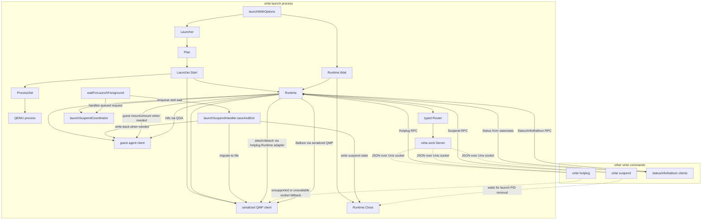

# Virtie Manager Refactor

Redesign `virtie/internal/manager` around a launch-owned runtime and typed
control socket.

**Status**: In-Progress

## Goals

Split the current manager package into smaller Go-standard-library-shaped
components that are easier to test, reason about, and extend.

- Make launch orchestration explicit: preflight planning, runtime startup,
  foreground waiting, and teardown should be separate operations.
- Keep one launch process as the owner of QMP, QGA, process state, suspend
  state, stats, and lifecycle transitions.
- Add `virtie.sock` as the external control surface for other `virtie`
  processes without allowing those processes to contend for `qmp.sock`.
- Prefer typed Go calls over stringly typed RPC calls at manager call sites.
- Preserve current CLI behavior during migration, including PID/signal and
  direct-QMP fallbacks until `virtie.sock` is stable.
- Keep the design congruent with the extended Go standard library: small
  interfaces, concrete structs with zero-surprise names, `context.Context`,
  `io`, `net`, `encoding/json`, and explicit `Close`/`Serve` style lifecycles.

Out of scope:

- Turning `virtie launch` into a background daemon.
- Implementing interactive remote command streaming through `virtie.sock`.
- Introducing a third-party RPC framework.
- Changing the public manifest contract except for adding the resolved
  control socket path if needed.
- Removing current CLI fallbacks in the first refactor.

Acceptance criteria:

- [x] `launchWithOptions` is reduced to composing `Plan`, `Launcher`,
  `Runtime`, and foreground wait/teardown calls.
- [x] The launch process starts a `virtie.sock` server after QMP readiness and
  stops it during teardown.
- [x] `virtie suspend` and `virtie hotplug` prefer typed client calls through
  `virtie.sock` when available. Balloon is exposed through the typed client and
  server capability model; adding a CLI command is optional follow-up work.
- [x] QMP-affecting runtime operations are serialized through the launch-owned
  runtime.
- [x] Existing `virtie/internal/manager` tests continue passing after each
  migration phase.
- [x] New tests cover typed RPC transport, socket permissions, status,
  suspend, hotplug, balloon, and info calls.

## Progress

- [x] Identified the current manager responsibilities and the need for a
  launch-owned control plane.
- [x] Chose `virtie.sock` as a control RPC socket rather than a full supervisor
  or first-version interactive stream transport.
- [x] Chose typed Go client and handler methods instead of exposing raw method
  strings to callers.
- [x] Extract planning, runtime ownership, and process grouping from the
  current launch path.
- [x] Move status and info behavior onto the core runtime interface, and move
  suspend, hotplug, and balloon behavior onto optional runtime capability
  interfaces.
- [x] Add the typed control socket server and client.
- [x] Route CLI control commands through `virtie.sock` with compatibility
  fallbacks.
- [x] Started the post-mortem corrective phase by extracting a resolved
  launch plan and lifecycle coordinator inside `manager` before any subpackage
  split.
- [x] Introduced `Launcher`, `DefaultConfig`, `LaunchSpec`, `Plan`, and
  `ProcessSet` as real manager package types while preserving the existing
  package-level launch entrypoints.
- [x] Moved launch process and QMP teardown ownership into idempotent
  `Runtime.Close`, with pre-runtime startup failures still cleaned up by the
  launch path.
- [x] Extracted foreground waiting into a named launch helper covering both
  interactive SSH sessions and headless VM waits.
- [x] Added `Launcher.Start`, `Runtime.Wait`, and `WaitMode`, with
  `LaunchWithOptions` now following the planned `Plan -> Start -> Wait ->
  Close` structure.
- [x] Split the typed control socket transport into
  `virtie/internal/manager/control`, with `manager` package aliases preserving
  the existing facade during the migration.
- [x] Split the QMP protocol client into `virtie/internal/qmpclient`, with
  `manager` package aliases preserving the current runtime interfaces.
- [x] Split the QGA protocol client into `virtie/internal/qga`, leaving guest
  provisioning orchestration in `manager`.
- [x] Split launch value types into `virtie/internal/manager/launch`,
  including `Plan`, launch options, wait mode, runtime paths, suspend state,
  notifier interface, and plan-owned socket cleanup.
- [x] Move the serialized QMP wrapper into `virtie/internal/qmpclient`, so the
  launch-owned runtime depends on a serialized client rather than owning the
  synchronization adapter itself.
- [x] Split managed task cancellation into `virtie/internal/manager/runtime`,
  with `manager` aliases preserving optional feature call sites.
- [x] Move `ProcessSet` into `virtie/internal/manager/runtime`, leaving
  optional feature discovery in `manager` and passing the resulting task group
  into the runtime process set.
- [x] Split the launch lifecycle coordinator into
  `virtie/internal/manager/launch`, so local signals and RPC suspend requests
  share one package-owned event path.
- [x] Move runtime close hook wiring into `virtie/internal/manager/runtime`,
  leaving the concrete `Runtime.Close` implementation in `manager`.
- [x] Move launch/runtime stats into `virtie/internal/manager/runtime`, with a
  package helper for converting stats into control-plane `RuntimeStats`.
- [x] Move suspend-state, VM-state, launch PID, and launch lock validation
  helpers into `virtie/internal/manager/launch`, with manager aliases
  preserving existing command and test call sites.

## Landed Control Flow

The current migration phase keeps `launchWithOptions` as the orchestration
entrypoint, but QMP-affecting control commands now prefer the launch-owned
runtime through `virtie.sock`. The launch process remains the owner of QMP,
QGA, process groups, suspend state, and runtime socket cleanup.



## Post-Mortem Follow-Up Plan

The control socket landed before the launch phases were extracted. That kept
the implementation shippable, but it also made lifecycle boundaries implicit
and caused review fixes around suspend ordering, launch teardown, and fallback
semantics. The next phase should pause new control-plane capabilities and
make the launch lifecycle explicit.

### Lessons Learned

- Control requests are lifecycle events, not just RPC methods. Suspend in
  particular must be owned by the launch loop because it coordinates guest
  file write-back, QMP migration, suspend metadata, foreground exit, PID
  removal, and teardown.
- Compatibility behavior is part of the contract during migration. Fallbacks
  for unavailable sockets, unsupported capabilities, PID/signal suspend, and
  direct-QMP hotplug need explicit tests before changing call paths.
- Starting the socket during startup exposes intermediate launch states to
  external commands. Any RPC that mutates VM state must either queue through
  the launch lifecycle or prove it is safe during guest provisioning, restore,
  SSH readiness, optional feature startup, and foreground waits.
- Sequence diagrams and request-flow tests should come before new runtime
  surfaces. The landed Mermaid diagram should be kept current as the
  extraction proceeds.

### Corrective Refactor Steps

1. Extract a small lifecycle coordinator from `launchWithOptions` before
   adding more RPC capabilities. It should own local signal requests, RPC
   requests, foreground wait events, suspend completion, info requests, and
   cancellation.
2. Move startup checkpoints into named phases: QMP ready, restore complete,
   guest provisioning complete, SSH readiness complete, optional features
   started, foreground wait active, and teardown. Each phase should define
   which lifecycle events it accepts and which are deferred.
3. Introduce a value-oriented launch plan for resolved paths, cleanup
   ownership, resume state, CID, QEMU command, run commands, and control socket
   path. Startup should consume the plan instead of repeatedly resolving
   manifest facts.
4. Keep `Runtime` focused on launch-owned resources and typed capability
   adapters. Avoid moving foreground lifecycle decisions into RPC handlers.
   RPC handlers may enqueue, wait, query, or adapt owned clients, but they
   should not independently advance launch state.
5. Turn compatibility behavior into a table in tests: socket unavailable,
   socket unsupported, socket failed-precondition, stale PID, saved state
   already present, hotplug-capable CLI talking to `virtie_no_hotplug` launch,
   and duplicate suspend requests.
6. Only after the lifecycle coordinator and plan extraction are stable, split
   code into `launch`, `runtime`, and `control` subpackages. Moving files
   before the boundaries are explicit would mostly preserve the current
   coupling under new package names.

### Acceptance Criteria For The Next Phase

- `launchWithOptions` reads as orchestration over a plan, lifecycle
  coordinator, runtime startup, foreground wait, and teardown rather than one
  monolithic control flow.
- Local signals and `virtie.sock` requests share one lifecycle event path for
  suspend and info.
- Tests cover suspend requests during startup provisioning, foreground SSH,
  headless VM wait, duplicate suspend, and teardown wait behavior.
- Fallback behavior for `Suspend` and `Hotplug` is documented in tests and
  does not depend on incidental error strings.
- The Mermaid diagram in this spec is updated in the same commit as any
  lifecycle topology change.

## Appendix

### Current Problems

`manager.launchWithOptions` currently owns most of the package behavior in one
large control flow: manifest validation, runtime path resolution, locking, CID
allocation, directory and socket cleanup, volume creation, host process start,
QEMU argv construction, QMP dialing, restore, guest file writes, SSH readiness,
optional features, SSH attach, signal handling, info requests, suspend, stats,
and teardown.

That shape makes it hard to add `virtie.sock` cleanly. External commands such
as `virtie hotplug` currently dial QMP directly, while `virtie suspend` signals
the launch process through a PID file. Issue #148 notes the core limitation:
QMP and other control sockets may only accept one listener at a time, so the
launch process needs to hold those sockets and accept simple JSON RPC
instructions through its own Unix socket.

### Proposed Package Shape

The refactor should keep `manager` as the package that adapts manifest facts,
QEMU/QMP/QGA, process execution, and CLI-visible lifecycle behavior. The new
shape should make the long-lived launch runtime explicit.

```go
type Launcher struct {
	Config Config
}

type Config struct {
	Runner       ProcessRunner
	Locker       Locker
	CIDAllocator CIDAllocator
	Sockets      SocketWaiter
	QMP          QMPDialer
	Guest        GuestDialer
	SSHReady     SSHReadyDialer
	Signals      SignalSource
	Notifier     Notifier
	Logger       *slog.Logger
	Stdout       io.Writer
	Stderr       io.Writer
	Timeouts     Timeouts
}

type LaunchSpec struct {
	Manifest      *manifest.Manifest
	RemoteCommand []string
	Options       LaunchOptions
}

type Plan struct {
	Manifest      *manifest.Manifest
	RemoteCommand []string
	Options       LaunchOptions
	Paths         RuntimePaths
	Resume        *SuspendState
	CID           int
	Runs          []CommandSpec
	QEMU          *exec.Cmd
	Volumes       []manifest.Volume
	Notifier      Notifier
}
```

`Plan` is intentionally value-oriented. It should contain resolved paths and
commands, not deferred calls back into the manifest wherever possible. This
makes preflight behavior independently testable and keeps launch startup from
rediscovering the same facts.

```go
type Runtime struct {
	Manifest  *manifest.Manifest
	Paths     RuntimePaths
	CID       int
	State     RuntimeState
	Stats     RuntimeStats
	QMP       QMPClient
	Guest     GuestClient
	Processes ProcessSet
	Server    *Server

	mu sync.Mutex
}

type RuntimePaths struct {
	StateDir          string
	RuntimeDir        string
	ControlSocket    string
	QMPSocket         string
	GuestAgentSocket string
	SSHReadySocket   string
	Cleanup           []string
}

type RuntimeState string

const (
	RuntimeStarting   RuntimeState = "starting"
	RuntimeReady      RuntimeState = "ready"
	RuntimeSuspending RuntimeState = "suspending"
	RuntimeSuspended  RuntimeState = "suspended"
	RuntimeStopping   RuntimeState = "stopping"
	RuntimeStopped    RuntimeState = "stopped"
)
```

`Runtime` should be the only in-process object allowed to perform
QMP-affecting lifecycle operations after QMP connects. Its methods should use
`mu` or an internal command queue to prevent suspend, hotplug, balloon control,
and shutdown from interleaving unsafe QMP command sequences.
Managed background tasks that affect QMP, such as the automatic balloon
controller, should also go through this same serializer. Optional feature tasks
must not retain direct, unsynchronized QMP access.

Callers should depend on narrow runtime capabilities rather than one broad
interface. The concrete launch-owned runtime may implement every capability,
but tests, RPC handlers, and command adapters should require only the methods
they actually call.

```go
func (l *Launcher) Plan(ctx context.Context, spec LaunchSpec) (*Plan, error)
func (l *Launcher) Start(ctx context.Context, plan *Plan) (*Runtime, error)

type RuntimeCore interface {
	Wait(ctx context.Context, mode WaitMode) error
	Close() error
	Status(ctx context.Context) (StatusResponse, error)
	Info(ctx context.Context) (InfoResponse, error)
}

type RuntimeSuspend interface {
	Suspend(ctx context.Context) (SuspendResponse, error)
}

type RuntimeHotplug interface {
	Hotplug(ctx context.Context, req HotplugRequest) (HotplugResponse, error)
}

type RuntimeBalloon interface {
	Balloon(ctx context.Context, req BalloonRequest) (BalloonResponse, error)
}
```

`RuntimeCore` is the minimum contract for a launched VM. `RuntimeSuspend`,
`RuntimeHotplug`, and `RuntimeBalloon` are add-on capabilities. `virtie.sock`
should register typed handlers only for capabilities implemented by the
runtime and should return a clear unsupported-capability error when a client
calls a method that was not registered.

`Info` stays on `RuntimeCore`; if QGA is unavailable, it returns a typed
failed-precondition error instead of making info itself an optional
capability.

Hotplug should remain backed by `internal/hotplug.Runtime`, which already has
narrow dependencies for state, QMP, QGA, socket waiting, and host processes.
The launch runtime should adapt its owned clients and process controls into
that package rather than merging hotplug internals into the core runtime.

Suspend is also an add-on capability, but it still owns launch-exit behavior:
guest file write-back when needed, QMP migration-to-file, suspend metadata
write, notification, and the transition that causes foreground wait/teardown
to finish as a saved suspend.

Balloon should remain backed by `internal/balloon`, which already owns QEMU
argument lowering, QMP monitor access, and the automatic controller task. The
launch runtime should adapt its owned QMP session into a balloon capability for
explicit query/resize requests while keeping the existing controller as an
optional managed task.

Signals should be treated as local control-plane requests rather than separate
runtime paths. `SIGTSTP` should call the same suspend capability path as RPC,
and `SIGUSR1` should call the same info path as RPC. Interrupt and termination
signals should continue to cancel and close the runtime.

The existing package-level functions can remain thin wrappers:

```go
func LaunchWithOptions(ctx context.Context, m *manifest.Manifest, remote []string, opts LaunchOptions) error {
	launcher := NewLauncher(DefaultConfig())
	plan, err := launcher.Plan(ctx, LaunchSpec{Manifest: m, RemoteCommand: remote, Options: opts})
	if err != nil {
		return err
	}
	runtime, err := launcher.Start(ctx, plan)
	if err != nil {
		return err
	}
	defer runtime.Close()
	return runtime.Wait(ctx, waitModeFromOptions(opts))
}
```

`Close` should be idempotent and lifecycle-state aware. Normal foreground
exit, startup failure, suspend-exit, control-server shutdown, and deferred
cleanup should all converge on the same close path without double-stopping
processes or double-removing runtime resources.

### Subpackage Split

Keep `virtie/internal/manager` as the public facade for CLI-facing package
functions: `LaunchWithOptions`, `Suspend`, `Hotplug`, and future adapters. New
implementation packages should avoid importing the facade package.

- `virtie/internal/manager/launch` (partial): launch value types including
  `Plan`, options, wait mode, runtime paths, suspend state, notifier
  interface, plan-owned socket cleanup, and lifecycle event coordination.
  Suspend-state and launch PID file helpers have also landed there. `Launcher`,
  `Config`, preflight resolution orchestration, startup sequencing, and
  conversion from manifest facts into runtime inputs still live in `manager`.
- `virtie/internal/manager/runtime` (partial): managed task cancellation,
  `ProcessSet`, close hook wiring, and runtime stats have landed. The
  launch-owned runtime, state machine, idempotent `Close`, and lifecycle
  adapters still live in `manager`.
- `virtie/internal/manager/control` (landed): `virtie.sock` request/response types,
  typed client, server, router, wire envelopes, error codes, and optional
  handler registration.
- `virtie/internal/qmpclient` (landed): QMP dial/client implementation,
  serialization adapter, and role interfaces used by runtime capabilities and
  add-on packages.
- `virtie/internal/qga` (landed): guest agent dial/client implementation and low-level
  QGA protocol helpers.

The existing add-on engines should remain independent of `manager` internals:
`virtie/internal/hotplug` remains the hotplug implementation engine, and
`virtie/internal/balloon` remains the balloon QEMU argument/controller engine.
`manager/runtime` adapts owned QMP, QGA, and process resources into those
packages.

### Process And Device Interfaces

Keep interfaces narrow and define them where they are consumed.

```go
type ProcessRunner interface {
	Start(*exec.Cmd) (*executor.Process, error)
}

type ProcessSet struct {
	Runs     executor.Group
	QEMU     *executor.Process
	Session  *executor.Process
	Features managedTaskGroup
}

func (p *ProcessSet) AddRun(proc *executor.Process)
func (p *ProcessSet) Watchers() executor.Group
func (p *ProcessSet) StopFeatures() error
func (p *ProcessSet) StopAll(delay time.Duration) error
```

Split broad device interfaces only when a caller benefits from the narrower
contract. `qmpClient` can be migrated toward role interfaces without forcing a
large rewrite up front.

```go
type PowerController interface {
	Stop(time.Duration) error
	Cont(time.Duration) error
	Quit(time.Duration) error
	QueryStatus(time.Duration) (string, error)
}

type MigrationController interface {
	MigrateToFile(time.Duration, string) error
	MigrateIncoming(time.Duration, string) error
	QueryMigrate(time.Duration) (string, error)
}

type DeviceController interface {
	RunRaw(time.Duration, string) error
	DeviceDelAndWait(time.Duration, string) error
}
```

### Typed RPC Control Plane

The control socket should expose typed Go APIs. The transport can still encode
an internal method discriminator, but raw method strings should be hidden inside
the transport implementation.

```go
type Client struct {
	dial func(context.Context) (net.Conn, error)
}

func Dial(path string) *Client

func (c *Client) Status(ctx context.Context, req StatusRequest) (StatusResponse, error)
func (c *Client) Suspend(ctx context.Context, req SuspendRequest) (SuspendResponse, error)
func (c *Client) Hotplug(ctx context.Context, req HotplugRequest) (HotplugResponse, error)
func (c *Client) Balloon(ctx context.Context, req BalloonRequest) (BalloonResponse, error)
func (c *Client) Info(ctx context.Context, req InfoRequest) (InfoResponse, error)
```

Handlers should be typed too. The control server should require `RuntimeCore`
and optionally register suspend, hotplug, and balloon handlers when the runtime
also implements `RuntimeSuspend`, `RuntimeHotplug`, or `RuntimeBalloon`.

```go
type RuntimeCore interface {
	Status(context.Context, StatusRequest) (StatusResponse, error)
	Info(context.Context, InfoRequest) (InfoResponse, error)
}

type RuntimeSuspend interface {
	Suspend(context.Context, SuspendRequest) (SuspendResponse, error)
}

type RuntimeHotplug interface {
	Hotplug(context.Context, HotplugRequest) (HotplugResponse, error)
}

type RuntimeBalloon interface {
	Balloon(context.Context, BalloonRequest) (BalloonResponse, error)
}

type RuntimeHandler struct {
	Core    RuntimeCore
	Suspend RuntimeSuspend
	Hotplug RuntimeHotplug
	Balloon RuntimeBalloon
}

type Router struct {
	Core    RuntimeCore
	Suspend RuntimeSuspend
	Hotplug RuntimeHotplug
	Balloon RuntimeBalloon
}
```

The control package should expose a concrete router that dispatches to these
typed handlers. `RuntimeCore` is required. `RuntimeSuspend`, `RuntimeHotplug`,
and `RuntimeBalloon` are optional and may be nil or absent from the runtime
handler. A router constructed without a core handler is invalid and should
fail at construction time.

### Consumer Usage Sketches

These examples are intentionally short. They should be used to validate whether
the proposed API feels ergonomic before the refactor locks in naming and
package boundaries.

The current CLI launch path should stay simple. It should not need to know
about QMP, QGA, socket cleanup, optional features, or process teardown.

```go
func (c *launchCommand) Execute(args []string) error {
	cfg, err := loadLaunchManifest(c.options.Manifest, manifestLogger)
	if err != nil {
		return err
	}

	return manager.LaunchWithOptions(context.Background(), cfg, c.Args.RemoteCommand, manager.LaunchOptions{
		Resume:    manager.ResumeMode(c.Resume),
		SSH:       c.SSH,
		Verbosity: len(c.options.Verbose),
	})
}
```

Code that wants more control than the package-level helper can use
`Launcher`, `Plan`, and `Runtime` directly. This is mostly useful for tests and
future integration points.

```go
launcher := manager.NewLauncher(manager.DefaultConfig())
plan, err := launcher.Plan(ctx, manager.LaunchSpec{
	Manifest:      cfg,
	RemoteCommand: []string{"uname", "-a"},
	Options:       manager.LaunchOptions{Resume: manager.ResumeModeAuto, SSH: true},
})
if err != nil {
	return err
}

runtime, err := launcher.Start(ctx, plan)
if err != nil {
	return err
}
defer runtime.Close()

return runtime.Wait(ctx, manager.WaitSSH)
```

External `virtie` subcommands should use typed client methods. The CLI should
construct request structs and receive response structs; it should not pass raw
method names.

```go
client := manager.Dial(cfg.ResolvedControlSocketPath())
status, err := client.Status(ctx, manager.StatusRequest{})
if err != nil {
	return err
}

fmt.Fprintf(stdout, "%s cid=%d\n", status.State, status.CID)
```

```go
client := manager.Dial(cfg.ResolvedControlSocketPath())
_, err := client.Hotplug(ctx, manager.HotplugRequest{
	ID:     id,
	Detach: detach,
})
return err
```

```go
client := manager.Dial(cfg.ResolvedControlSocketPath())
resp, err := client.Suspend(ctx, manager.SuspendRequest{})
if err != nil {
	return err
}
if resp.Saved {
	fmt.Fprintf(stdout, "saved VM state: %s\n", resp.VMStatePath)
}
```

In-process signal handling should call the same runtime methods as RPC
handlers. For example, `SIGUSR1` should become a local shortcut for `Info`.

```go
case syscall.SIGUSR1:
	info, err := runtime.Info(ctx, manager.InfoRequest{})
	if err != nil {
		logger.Info("guest info failed", "err", err)
		continue
	}
	if info.ProcessList != "" {
		fmt.Fprintln(stdout, info.ProcessList)
	}
```

Tests should be able to fake the typed handler without simulating JSON or Unix
sockets unless the transport itself is under test.

```go
type fakeHandler struct {
	hotplug manager.HotplugRequest
}

func (h *fakeHandler) Status(context.Context, manager.StatusRequest) (manager.StatusResponse, error) {
	return manager.StatusResponse{State: manager.RuntimeReady, CID: 7}, nil
}

func (h *fakeHandler) Hotplug(ctx context.Context, req manager.HotplugRequest) (manager.HotplugResponse, error) {
	h.hotplug = req
	return manager.HotplugResponse{ID: req.ID, Detach: req.Detach}, nil
}
```

A small server should mirror familiar `net/http` conventions without importing
HTTP semantics into the wire protocol.

```go
type Server struct {
	Handler *Router
	Logger  *slog.Logger
}

func Listen(path string) (net.Listener, error)
func Serve(l net.Listener, h *Router) error
func ListenAndServe(path string, h *Router) error

func (s *Server) Serve(l net.Listener) error
func (s *Server) Close() error
```

The initial wire format can be one newline-delimited JSON request per
connection. Persistent connections can be added later without changing the
typed client API.

```json
{"id":1,"method":"status","params":{}}
{"id":1,"result":{"state":"ready","cid":7}}
{"id":1,"error":{"code":"failed_precondition","message":"guest agent socket is not configured"}}
```

Internal transport structs may look like this:

```go
type requestEnvelope struct {
	ID     int             `json:"id"`
	Method rpcMethod       `json:"method"`
	Params json.RawMessage `json:"params"`
}

type responseEnvelope struct {
	ID     int             `json:"id"`
	Result json.RawMessage `json:"result,omitempty"`
	Error  *RPCError       `json:"error,omitempty"`
}

type rpcMethod string

const (
	rpcStatus  rpcMethod = "status"
	rpcSuspend rpcMethod = "suspend"
	rpcHotplug rpcMethod = "hotplug"
	rpcBalloon rpcMethod = "balloon"
	rpcInfo    rpcMethod = "info"
)
```

The string values are protocol details only. Callers use `Client.Status`,
`Client.Suspend`, `Client.Hotplug`, `Client.Balloon`, and `Client.Info`.

```go
type RPCError struct {
	Code    ErrorCode `json:"code"`
	Message string    `json:"message"`
}

type ErrorCode string

const (
	ErrInvalidRequest    ErrorCode = "invalid_request"
	ErrUnknownMethod     ErrorCode = "unknown_method"
	ErrInvalidParams     ErrorCode = "invalid_params"
	ErrUnsupported       ErrorCode = "unsupported"
	ErrFailedPrecondition ErrorCode = "failed_precondition"
	ErrInternal          ErrorCode = "internal"
)
```

Use `unsupported` only when the runtime does not implement the requested
capability. Use `failed_precondition` when the capability exists but the
manifest or current runtime state cannot perform it, such as missing QGA for
info or a missing configured balloon device for balloon requests.

### RPC Data Types

Keep request and response types small and explicit. Avoid exposing internal
manager structs directly on the wire.

```go
type StatusRequest struct{}

type StatusResponse struct {
	State RuntimeState `json:"state"`
	CID   int          `json:"cid"`
	Paths StatusPaths  `json:"paths"`
	Stats RuntimeStats `json:"stats"`
}

type StatusPaths struct {
	ControlSocket    string `json:"controlSocket"`
	QMPSocket         string `json:"qmpSocket"`
	GuestAgentSocket string `json:"guestAgentSocket,omitempty"`
	SSHReadySocket   string `json:"sshReadySocket,omitempty"`
}

type SuspendRequest struct{}

type SuspendResponse struct {
	Saved       bool   `json:"saved"`
	VMStatePath string `json:"vmStatePath,omitempty"`
}

type HotplugRequest struct {
	ID     string `json:"id"`
	Detach bool   `json:"detach"`
}

type HotplugResponse struct {
	ID     string `json:"id"`
	Detach bool   `json:"detach"`
}

type BalloonRequest struct {
	TargetBytes int64 `json:"targetBytes,omitempty"`
}

type BalloonResponse struct {
	ActualBytes int64 `json:"actualBytes"`
	TargetBytes int64 `json:"targetBytes,omitempty"`
}

type InfoRequest struct{}

type InfoResponse struct {
	ProcessList string `json:"processList,omitempty"`
}
```

A zero `BalloonRequest.TargetBytes` means query only. A positive
`TargetBytes` requests an explicit balloon resize and returns both the observed
actual size before the operation and the requested target. The automatic
balloon controller may still run as a managed task; explicit resize calls must
share the same runtime QMP serialization path as the controller. Explicit
resize is best-effort and may be superseded by the automatic controller if it
is enabled.

`RuntimeStats` should be the exported or wire-safe equivalent of the current
`launchStats`. It can retain monotonic launch timestamps internally but should
serialize durations or wall-clock times explicitly.

### Socket Path And Permissions

`virtie.sock` should follow the same runtime directory policy as QMP, QGA, SSH
readiness, and managed virtiofs sockets:

- If `paths.runtimeDir` is omitted, relative socket paths resolve from
  `paths.workingDir`.
- If `paths.runtimeDir` is the empty string, relative socket paths resolve
  under the per-user XDG runtime location at `agentspace/<hostName>/...`.
- The default control socket name is `virtie.sock`.
- Owned runtime directories should be created with mode `0700`.
- The socket should not be globally readable or writable. Target mode is
  `0600` after listen.
- Stale control sockets can be removed during launch preflight only when they
  resolve as launch-owned runtime paths.

### Migration Plan

1. Extract `Plan`, `RuntimePaths`, and preflight resolution from
   `launchWithOptions`. `Plan` and `RuntimePaths` have landed under
   `manager/launch` with facade aliases. Lifecycle coordination has also
   moved there, along with suspend-state and launch PID helpers. Preflight
   resolution orchestration still lives in `manager`.
2. Introduce `Launcher`, `Runtime`, and `ProcessSet`. Move startup and teardown
   code behind methods while keeping `LaunchWithOptions` as the public wrapper.
   Managed task cancellation and `ProcessSet` have landed under
   `manager/runtime`; the concrete `Runtime` type still lives behind the
   `manager` facade.
3. Split QMP and QGA protocol clients into dependency-only packages, then adapt
   manager call sites to use the same interfaces through the facade. QMP has
   landed under `internal/qmpclient`; QGA has landed under `internal/qga` with
   guest provisioning orchestration still in `manager`.
4. Introduce `RuntimeCore`, `RuntimeSuspend`, `RuntimeHotplug`, and
   `RuntimeBalloon`. Move status and info onto the core runtime, move suspend,
   hotplug, and balloon onto optional capability implementations, and keep old
   package-level entrypoints as adapters.
5. Add `Client`, `Server`, typed request/response structs, router, and
   Unix-socket transport tests under `manager/control`. This has landed with
   temporary aliases in `manager` for migration compatibility.
6. Start `virtie.sock` from the launch runtime after QMP readiness. Register
   core handlers unconditionally and capability handlers only when implemented.
   Stop the server before process teardown and socket cleanup.
7. Route `virtie suspend` and `virtie hotplug` through the typed client when
   the socket exists. Expose balloon through the typed client/server
   capability, but do not require a balloon CLI command in this phase. Fall
   back to PID/signal and direct QMP while migration is in progress.
8. Revisit fallback removal after the socket contract has been exercised by
   tests and normal CLI use.

### Test Plan

- Keep existing manager tests passing during each extraction.
- Add `Plan` tests for resolved control socket paths, cleanup ownership, resume
  state, and remote command validation.
- Add `Runtime` tests for serialized suspend, hotplug, info, and shutdown
  paths using existing fake QMP/QGA/process harnesses.
- Add lifecycle tests for idempotent `Close` across normal exit, launch
  failure, suspend exit, and control-server shutdown.
- Add handler registration tests for runtimes that implement only
  `RuntimeCore`, `RuntimeCore` plus `RuntimeSuspend`, `RuntimeCore` plus
  `RuntimeHotplug`, `RuntimeCore` plus `RuntimeBalloon`, and all capabilities.
- Add balloon capability tests for query-only requests, explicit resize
  requests, disabled balloon devices, and serialization with the automatic
  controller task.
- Add RPC transport tests with `net.Pipe` or Unix sockets under `t.TempDir`.
- Test unknown method, unsupported capability, invalid JSON, invalid params,
  typed error mapping, and successful typed calls.
- Test unsupported versus failed-precondition error mapping for all optional
  capabilities.
- Verify `virtie.sock` permissions are owner-only.
- Verify CLI `Suspend` and `Hotplug` prefer `virtie.sock` and do not open a
  second QMP connection when the launch server is present.
- Run `CGO_ENABLED=0 go test ./...` from `virtie/`.
- If Nix-facing socket resolution changes, run the relevant flake checks and
  clean any `./result` symlinks with `unlink`.

### Future Work

- Add a typed remote execution or SSH attach call after the control plane is
  stable. That call may need stream support, so it should be designed
  separately from the one-request JSON RPC path.
- Decide when to remove PID/signal and direct-QMP compatibility fallbacks.
- Consider moving pure protocol code to a subpackage if `manager` becomes too
  broad after the control socket lands.
