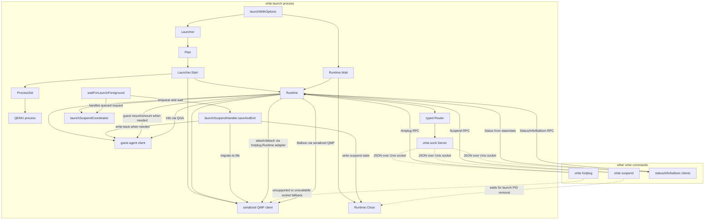

# Virtie Manager Refactor

Redesign `virtie/internal/manager` around a launch-owned runtime and typed
control socket.

**Status**: Complete

## Goals

Split the current manager package into smaller Go-standard-library-shaped
components that are easier to test, reason about, and extend.

- Make launch orchestration explicit: preflight planning, runtime startup,
  foreground waiting, and teardown should be separate operations.
- Keep one launch process as the owner of QMP, QGA, process state, suspend
  state, stats, and lifecycle transitions.
- Add `virtie.sock` as the external control surface for other `virtie`
  processes without allowing those processes to contend for `qmp.sock`.
- Prefer typed Go calls over stringly typed RPC calls at manager call sites.
- Preserve current CLI behavior during migration, including PID/signal and
  direct-QMP fallbacks until `virtie.sock` is stable.
- Keep the design congruent with the extended Go standard library: small
  interfaces, concrete structs with zero-surprise names, `context.Context`,
  `io`, `net`, `encoding/json`, and explicit `Close`/`Serve` style lifecycles.

Out of scope:

- Turning `virtie launch` into a background daemon.
- Implementing interactive remote command streaming through `virtie.sock`.
- Introducing a third-party RPC framework.
- Changing the public manifest contract except for adding the resolved
  control socket path if needed.
- Removing current CLI fallbacks in the first refactor.

Acceptance criteria:

- [x] `launchWithOptions` is reduced to composing `Plan`, `Launcher`,
  `Runtime`, and foreground wait/teardown calls.
- [x] The launch process starts a `virtie.sock` server after QMP readiness and
  stops it during teardown.
- [x] `virtie suspend` and `virtie hotplug` prefer typed client calls through
  `virtie.sock` when available. Balloon is exposed through the typed client and
  server capability model; adding a CLI command is optional follow-up work.
- [x] QMP-affecting runtime operations are serialized through the launch-owned
  runtime.
- [x] Existing `virtie/internal/manager` tests continue passing after each
  migration phase.
- [x] New tests cover typed RPC transport, socket permissions, status,
  suspend, hotplug, balloon, and info calls.

## Implementation Inventory

The refactor has landed as a set of smaller package-owned abstractions rather
than one manager-local launch path. This inventory is the current map of those
abstractions and their ownership boundaries.

### `virtie/internal/manager` Facade

- `Launcher`, `DefaultConfig`, and `LaunchWithOptions` remain the CLI-facing
  entrypoints. They now compose launch planning, runtime startup, foreground
  wait, and cleanup instead of owning every lifecycle detail inline.
- Type aliases in `launcher.go` and `control_rpc.go` preserve the historical
  manager package surface for callers while the implementation lives in
  `manager/launch`, `manager/runtime`, and `manager/control`.
- The remaining private `manager` code primarily adapts manifest data, concrete
  QEMU/QMP/QGA dependencies, notification commands, lock files, signal
  delivery, and compatibility fallbacks into the package-owned abstractions.

### `virtie/internal/manager/launch`

- `Spec`, `Options`, `ResumeMode`, `WaitMode`, `RuntimePaths`, `SuspendState`,
  and `Plan` describe resolved launch inputs, runtime socket paths, resume
  metadata, and plan-owned cleanup.
- `BuildPlan`, `ResolveResumeState`, `AcquireCID`, `FinalizeLockedPlan`, and
  `SetupLockedPlan` own pre-runtime planning: resume policy, CID selection,
  QEMU command finalization, filesystem preparation, and lock-scoped cleanup.
- `Config` and its narrow dependency interfaces (`Runner`, `Locker`,
  `SocketWaiter`, `VSockCIDChecker`, `PIDSignaler`, `SSHReadyDialer`) define the
  concrete services manager supplies to launch orchestration.
- `RuntimeLock`, launch PID helpers, stale-process classification, VM state
  path helpers, and saved-state polling centralize process ownership and
  suspend fallback behavior.
- `Lifecycle`, `SuspendCoordinator`, `EventWait`, `ProcessWait`, and
  `LifecycleProcessWait` provide the shared event path for local signals, RPC
  suspend requests, info requests, foreground process exits, and cancellation.
- `RunStarter`, `StartQEMU`, `RuntimeStartup`, `StartRuntimeProcesses`, and
  `FinalizeRuntimeStartup` own startup sequencing through run commands, QEMU,
  QMP readiness, shutdown hooks, and boot stats.
- `AsyncWait`, `SocketWait`, `QMPWait`, `GuestAgentWait`, and `SSHReadyWait`
  package socket waiting, retry dialing, readiness checks, cancellation, and
  stage wrapping for QMP, QGA, virtiofs, and SSH readiness.
- `RuntimeRestore` and `RuntimeSuspendSave` orchestrate QMP restore/save with
  suspend metadata and notifications, while `qmpclient` owns the protocol-level
  migration loops.
- `RuntimeActivation` sequences ready-state marking, control socket startup,
  queued suspend handling, guest provisioning, and write-back enablement.
- `ForegroundWait`, `SSHSession`, `SSHAutoprovisionKey`, and related SSH command
  builders own SSH/headless foreground wait selection, retry behavior,
  autoprovisioning, process supervision, and command hints.
- `GuestProvision`, `GuestFileWriter`, `GuestFileWriteBacker`,
  `GuestDirectoryInstaller`, and `WorkspaceCWDMounter` own guest-file payloads,
  directory creation policy, workspace CWD mounting, write-back filtering, and
  host write-back helpers.
- `NotificationSink`, `NotifierFactory`, `SelectNotifier`,
  `NotifyRuntimeResume`, and `NotifyRuntimeSuspend` keep lifecycle notification
  payload construction outside the concrete manager.
- `StageError`, `CommandError`, `WrapStage`, `WrapCommandError`,
  `WrapHotplugError`, and `FirstUnexpectedExit` centralize launch-stage error
  classification and wrapping.

### `virtie/internal/manager/runtime`

- `RuntimeConfig`, `Dependencies`, and `Runtime` define the launch-owned runtime
  object. The constructor serializes the supplied QMP client and stores explicit
  dependencies instead of retaining a back-reference to `manager`.
- `ProcessSet`, `Task`, and `TaskGroup` own QEMU, helper processes, optional
  feature tasks, watcher groups, and cancellation.
- `State` owns runtime state transitions (`starting`, `ready`, `suspending`,
  `suspended`, `stopping`, `stopped`) used by status, suspend, wait, and close
  paths.
- `ControlServer` and `StartControl` wire the concrete runtime into the typed
  `virtie.sock` server and keep server shutdown under runtime cleanup.
- `Closer`, `CloseActions`, `CloseHooks`, `CloseHookActions`, and
  `CloseHookConfig` define idempotent runtime teardown ordering: write-back,
  control shutdown, process teardown, QMP disconnect, cleanup, stats
  finalization, and output formatting.
- `StartupFailureConfig`, `StartupFailureActions`, and startup failure helpers
  share cleanup ordering for failures before a full runtime exists.
- `Stats` and control-plane conversion helpers track launch timing and format
  status/runtime output.
- `SavedSuspendState` and `WriteBackState` coordinate saved-suspend exits and
  write-back-on-exit gating across foreground wait, suspend save, close hooks,
  and startup failure cleanup.
- `ForegroundWaitOperation`, `ControlWaitForeground`, `SuspendOperation`,
  `ControlSuspend`, `GuestInfo`, `InfoCollector`, `ControlInfo`,
  `BalloonQMP`, `ControlBalloon`, and hotplug adapters implement typed runtime
  capabilities over narrow dependencies.
- `HotplugRuntime`, `HotplugStarter`, `HotplugSocketWaiter`, `HotplugGuest`, and
  `HotplugQMP` adapt the owned runtime resources into `internal/hotplug` while
  preserving build-tagged unsupported responses.

### `virtie/internal/manager/control`

- `RuntimeState`, request/response structs, `RuntimeStats`, `StatusPaths`,
  `ErrorCode`, and `RPCError` define the typed JSON-over-Unix-socket control
  protocol.
- `RuntimeCore`, `RuntimeSuspend`, `RuntimeHotplug`, and `RuntimeBalloon` are
  the capability interfaces registered by the control router.
- `Router`, `NewRouter`, and `NewRuntimeRouter` map typed methods to runtime
  capabilities and return typed unsupported/failed-precondition errors instead
  of exposing method strings to manager callers.
- `Listen`, `Serve`, `ListenAndServe`, `Server`, `Dial`, and `Client` implement
  the transport lifecycle and typed client calls for status, info, suspend,
  hotplug, and balloon.
- `FailedPrecondition`, `IsSocketUnavailable`, and `IsUnsupported` centralize
  compatibility decisions for CLI fallbacks.

### `virtie/internal/qmpclient`

- `Client`, `Dialer`, and `SocketMonitorDialer` isolate QMP protocol access from
  manager/runtime orchestration.
- `Serialized` wraps any QMP client so launch-owned runtime operations, hotplug,
  balloon control, suspend save, restore, and shutdown do not interleave unsafe
  QMP command sequences.
- `DialRetry` and `DialWithRetry` own retry/cancellation mechanics for QMP
  startup connection attempts.
- `MigrationWait`, `RestoreWait`, `SaveWait`, `WaitForMigration`,
  `RestoreFromFile`, and `SaveToFile` own protocol-level migration polling,
  restore, and suspend-save sequencing.

### `virtie/internal/qga`

- `Client`, `Dialer`, `SocketDialer`, and `ExecStatus` isolate QGA socket and
  command protocol access from manager orchestration.
- `DialRetry` and `DialWithRetry` own QGA retry and ping-readiness mechanics.
- `WriteFile` and `ReadFile` provide close-safe guest file transfer primitives.
- `ExecWait`, `RunCommandStatus`, `ExecOutputSuffix`, and `DecodeExecData` own
  guest-exec polling and output formatting.
- `Process`, `ParseProcesses`, `FormatProcesses`, and
  `FormatProcessListExecData` own guest process-list parsing and display
  formatting used by runtime info.

## Abstraction Audit

This audit separates valuable behavior from abstraction shape. Some helpers
below are worth keeping as behavior but not necessarily as their current
callback-heavy operation structs.

Evaluation criteria:

- Keep abstractions that protect a real boundary: process ownership, external
  protocol shape, socket lifecycle, QMP serialization, guest-agent protocol,
  filesystem state, or compatibility fallback semantics.
- Keep abstractions that gather domain policy which is hard to test safely
  through the full VM lifecycle.
- Question abstractions that mostly pass callbacks through one call site, hide
  linear launch flow, or exist only to make unit tests independent from nearby
  concrete types.
- Undo abstractions that duplicate another layer, preserve obsolete migration
  compatibility, or wrap a single field/action without improving ownership.

### 1. Smallest Subset Obviously Worth Keeping

These are the abstractions that are carrying clear weight. Removing them would
either reintroduce unsafe resource ownership, make compatibility behavior
stringly typed again, or push protocol/state policy back into the manager
orchestration path.

- `virtie/internal/manager/control`: keep the typed `virtie.sock` protocol:
  request/response structs, `RuntimeState`, `RuntimeStats`, `RPCError`,
  `Router`, `Server`, and `Client`.

  Why: this is the external control contract. It prevents other `virtie`
  processes from contending for QMP, gives CLI fallbacks typed errors to
  inspect, and keeps method strings inside the transport package.

- `control.RuntimeCore`, `RuntimeSuspend`, `RuntimeHotplug`, and
  `RuntimeBalloon`: keep the capability split.

  Why: optional capabilities are real. Hotplug and balloon are build/config
  dependent, while status and info are core control-plane operations. This
  split lets unsupported calls return explicit `unsupported` errors.

- `virtie/internal/qmpclient`: keep `Client`, `Dialer`,
  `SocketMonitorDialer`, `Serialized`, retry dialing, and migration helpers.

  Why: this is a true protocol boundary. `Serialized` is especially important
  because suspend, hotplug, balloon, restore, and shutdown all share one owned
  QMP connection and must not interleave unsafe command sequences.

- `virtie/internal/qga`: keep `Client`, `Dialer`, `SocketDialer`,
  `ExecStatus`, retry dialing, file transfer helpers, guest-exec polling, and
  process-list parsing/formatting.

  Why: QGA details are protocol-level behavior, not launch orchestration.
  Close-safe file transfer, ping readiness, exec polling, and output decoding
  are independently testable and would make `manager` much harder to read if
  inlined.

- `launch.Plan`, `Spec`, `Options`, `WaitMode`, `RuntimePaths`, and
  `SuspendState`: keep the value-oriented launch plan and state values.

  Why: this was the main corrective extraction. It stops startup from
  repeatedly rediscovering manifest facts, gives tests a concrete resolved
  launch object, and makes cleanup/socket ownership explicit.

- `launch.BuildPlan`, resume-state resolution, CID acquisition, locked-plan
  setup, filesystem preflight, and QEMU command finalization.

  Why: these functions own pre-runtime invariants and failure cleanup. They
  are a good package boundary even if some parameter structs around them can be
  simplified later.

- Launch PID, lock, suspend-state, saved-state polling, and stale-process
  helpers in `manager/launch`.

  Why: startup and compatibility suspend both depend on the same filesystem
  and process invariants. Centralizing them avoids two subtly different
  interpretations of "is this launch process still alive?"

- `launch.Lifecycle` and `launch.SuspendCoordinator`: keep the shared event
  path for local signals and RPC suspend requests.

  Why: suspend is a lifecycle event, not just an RPC method. The coordinator
  is what lets an external suspend request queue through foreground launch
  handling and wait for the launch-owned save/exit path.

- `runtime.Runtime`: keep the launch-owned runtime as the long-lived owner of
  QMP, process state, stats, control socket, suspend queue, and runtime
  lifecycle transitions.

  Why: this is the core safety boundary introduced by the refactor. It removes
  the previous direct-QMP contention problem and gives control methods a
  concrete owned object to operate through.

- `runtime.ProcessSet`, `Task`, and `TaskGroup`: keep process/task ownership.

  Why: QEMU, run commands, foreground SSH, and optional feature tasks need
  ordered shutdown and watcher snapshots. This is a cohesive state holder, not
  incidental indirection.

- `runtime.State` and `runtime.Stats`: keep runtime state and launch timing as
  package-owned data.

  Why: status reporting, close transitions, suspend transitions, and CLI
  output all need consistent state/stat formatting. These are small, but they
  are central and have multiple real consumers.

- `runtime.Closer` / close ordering and startup-failure cleanup behavior:
  keep the idempotent teardown behavior and explicit cleanup order.

  Why: write-back, control shutdown, process teardown, QMP disconnect, socket
  cleanup, lock cleanup, and stats finalization are fragile if scattered. The
  exact wrapper shape is debatable, but the policy should stay centralized.

- `launch.SaveRuntimeSuspend` and `launch.RestoreRuntime`: keep suspend/restore
  orchestration around QMP migration helpers.

  Why: they bind protocol operations to metadata, stale-state removal, and
  notifications. That is lifecycle policy, not raw QMP behavior.

- `launch.WriteGuestFiles`, `WriteBackGuestFiles`,
  `InstallGuestFileDirectory`, `MountWorkspaceCWD`, and host read/write-back
  helpers.

  Why: guest-file behavior contains enough policy to justify isolation:
  symlink handling, overwrite semantics, parent directory creation,
  ownership/mode translation, atomic host write-back, and workspace mount
  command construction.

- `launch.RunSSHSession`, SSH command builders, and SSH autoprovision helpers.

  Why: retry classification, delayed stderr reveal, autoprovisioning, identity
  switching, stats, and foreground process ownership are cohesive SSH-session
  policy. Keeping this out of `manager.go` is worth it.

- Pre-existing `internal/executor`, `internal/hotplug`, `internal/balloon`,
  `internal/readiness`, and `internal/sshtools`: keep them as separate domain
  packages.

  Why: these packages already own nontrivial process, hotplug, memory
  controller, token-readiness, and SSH failure-classification behavior. The
  manager/runtime refactor should adapt to them, not absorb them.

### 2. On The Fence

These abstractions may be worth keeping, but the current shape is not
obviously the simplest one. They deserve cleanup pressure before more features
are layered on top.

- `manager.Launcher.Plan` and `manager.Launcher.Start`.

  Keep for now because they make `Plan -> Start -> Wait -> Close` explicit and
  are useful in tests. Reconsider later if no caller outside manager tests
  needs partial launch lifecycle access.

  Code weight: low. The raw wrappers are about 14 non-test LOC. A practical
  cleanup that collapses the public partial-lifecycle split and removes now
  unused facade aliases would likely shed about 25-35 LOC. Removing the
  broader `Launcher` facade entirely would be closer to 40-55 LOC, but that
  also gives up the configurable launcher shape rather than just `Plan` and
  `Start`.

- `launch.Config`, `MergeConfig`, and the dependency interfaces it owns.

  The injection seam is useful for tests and for avoiding globals, but it may
  belong in `manager` rather than `manager/launch`. Today the config type mixes
  launch-level dependencies with manager-specific defaults and timeouts.

  Code weight: medium if improved, high only if deleted. Rehoming config to
  `manager`, making merge/defaulting private, and collapsing mirrored manager
  fields would likely shed or simplify about 45-70 non-test LOC while keeping
  `NewLauncher(Config{...})` as the test seam. Full removal of config-based
  dependency injection could net about 130-180 LOC, but it would force broad
  test rewrites and direct default wiring.

- Generic async/process wait stack: `AsyncWait`, `SocketWait`, `EventWait`,
  `ProcessWait`, `LifecycleProcessWait`, and the QMP/QGA/SSH-ready wait
  structs.

  These reduce duplicated cancellation, watcher checks, stage wrapping, and
  socket readiness behavior. The downside is a callback-heavy mini-framework
  for a small number of call sites. Keep the tested behavior, but consider
  collapsing some layers into clearer functions such as "wait for socket while
  checking watchers" and "wait for process/lifecycle event."

  Code weight: very high. A full simplification of the stack is estimated at
  roughly 250-330 net non-test LOC. A less aggressive cleanup that keeps named
  wait helpers but collapses callback structs/layers is still around 140-210
  LOC. The most promising increments are replacing `AsyncWait`/`SocketWait`
  with one concrete socket-wait helper (50-80 LOC), collapsing
  `EventWait`/`ProcessWait`/`LifecycleProcessWait` into one lifecycle/process
  wait path (70-110 LOC), and removing `QMPWait`/`GuestAgentWait` structs in
  favor of direct functions or manager methods (80-110 LOC combined).

- `launch.RuntimeStartup` and `StartRuntimeProcesses`.

  This owns a meaningful startup sequence, but the struct mostly carries
  callbacks supplied by `manager.startLaunchRuntime`. It may remain justified
  if startup phases keep growing; otherwise a method on a concrete launch
  starter would be easier to follow.

  Code weight: medium. Full removal by inlining the sequence into
  `manager.startLaunchRuntime`, while keeping reusable helpers such as
  `StartRuns`, `StartQEMU`, `WaitForSockets`, and `WaitForQMP`, would likely
  shed about 50-70 net non-test LOC. Improvement-only cleanup while keeping
  the helper is closer to 10-20 LOC. Folding adjacent
  `FinalizeRuntimeStartup` into the caller could add another 10-20 LOC.

- `launch.ForegroundWait`.

  This is more defensible than `RuntimeActivation` because SSH/headless
  behavior and restored-state cleanup are branching foreground policy. Still,
  the `ForegroundRuntime` and `ForegroundProcesses` interfaces are very narrow
  and only exist to decouple tests from concrete runtime/process types.

  Code weight: medium. Full removal and inlining into
  `manager.waitForLaunchForeground` would likely shed about 45-55 net non-test
  LOC. Improvement-only cleanup, mostly removing the narrow
  `ForegroundRuntime` / `ForegroundProcesses` interfaces while keeping the
  abstraction, would save only about 5-10 LOC. If the adjacent
  `runtime.ForegroundWaitOperation` cleanup is bundled, add roughly 15-20 LOC
  of possible savings.

- `runtime.ControlInfo`, `ControlBalloon`, `ControlSuspend`,
  `ControlWaitForeground`, and `runtime.Hotplug`.

  These provide nice isolated tests for response construction and
  failed-precondition mapping, but most are thin wrappers over concrete
  runtime methods. Keep them only where they prevent repeated error mapping;
  otherwise let `Runtime` methods call the underlying domain helpers directly.

  Code weight: low to medium. The practical cleanup is about 25-35 net
  non-test LOC by removing the named `Control*`/`Hotplug` wrappers and inlining
  small response/error mapping into concrete `Runtime` methods. A broader
  collapse of helper-only structs/interfaces around info, suspend, foreground
  wait, and balloon could reach 80-120 LOC, but hotplug QMP/start/socket/guest
  adapters should stay unless the build-tag layout changes.

- `runtime.CloseHooks`, `CloseHookActions`, `CloseHookConfig`, and
  `ConfiguredCloseHooks`.

  The write-back gating and joined cleanup behavior are useful. The two-level
  "actions" vs "config" shape is probably more than the code needs.

  Code weight: low to medium. Collapsing `CloseHookActions`/`NewCloseHooks`
  and one of `CloseHookConfig` / `ConfiguredCloseHooks`, while keeping a small
  `CloseHooks` callback bag, is estimated at 15-30 net non-test LOC. Full
  removal of the hook type and `Runtime.SetCloseHooks` would be around 30-45
  LOC, but only makes sense if runtime construction is already being reworked.

- `runtime.StartupFailureActions`, `StartupFailureConfig`,
  `ConfiguredStartupFailureActions`, and `CleanupConfiguredStartError`.

  Centralized startup cleanup is valuable. The configured/action split may be
  unnecessary unless there are multiple real constructors.

  Code weight: low to medium. Removing the configured layer
  (`StartupFailureConfig`, `ConfiguredStartupFailureActions`, and
  `CleanupConfiguredStartError`) and building `StartupFailureActions` directly
  in `manager.startWithPlan` would shed about 20-25 non-test LOC. Full removal
  of `startup_failure.go` and inlining equivalent cleanup into the launch
  defer could net about 70-85 LOC, but would push fragile cleanup ordering back
  into the main launch path.

- Tiny capability interfaces such as `SuspendRequester` and `HotplugRuntime`.

  These follow Go's "accept small interfaces" style and can protect package
  boundaries. Keep them only where a second production implementation exists
  or where the interface is the clearest adapter to another domain package.

  Code weight: low. The strict payoff is about 10-15 non-test LOC, mostly from
  removing `runtime.HotplugRuntime` and inlining attach/detach response
  construction into `Runtime.Hotplug`. `SuspendRequester` saves almost nothing
  by itself, roughly 0-3 LOC, and is only worth touching as part of a broader
  suspend/control wrapper collapse. Adjacent hotplug adapter interfaces could
  simplify another 10-15 LOC in `runtime`, but repo-wide savings may be near
  zero unless build-tag boundaries change.

### 3. Obviously Overcomplicating And Safe To Undo

These can be collapsed without losing the refactor's safety properties. Most
are internal-only, single-call-site, or leftover migration compatibility
facades.

- Broad manager facade aliases in `manager/control_rpc.go`.

  No production caller currently needs these control aliases. Internal tests
  and manager code should import `manager/control` directly for
  `StatusRequest`, `Router`, `Client`, `RPCError`, and related protocol types.
  The current alias set makes it look like `manager` still owns the control
  protocol after that ownership moved.

- Most manager facade aliases in `manager/launcher.go` other than
  `LaunchOptions`, `ResumeMode`, and perhaps `WaitMode`.

  `Plan`, `RuntimePaths`, `Config`, and `Runtime` are internal package types.
  Aliasing them through `manager` preserved migration call sites but now blurs
  ownership. Tests can import `manager/launch` or `manager/runtime` directly
  where they need those concrete types.

- `launch.RunStarter`.

  `StartRuns` contains useful behavior, but the `RunStarter` struct is a
  single-use bundle for runner/logger/shutdown delay. Passing those values
  directly, or making them fields on a broader launcher dependency, would be
  clearer.

- `launch.NotifierFactory` and `SelectNotifier`.

  This is a one-branch dependency-selection helper. Inline it in
  `manager.planLaunch` and keep `NotificationSink` plus the concrete notifier.

- `launch.RuntimeActivation`.

  Unless more phase policy is added, inline the activation sequence back into
  `manager.startWithPlan`. The current abstraction mostly hides ordering
  behind callback names and makes the launch path harder to read.

- `launch.GuestProvision`.

  Keep `WriteGuestFiles`, `WaitForSSHReady`, and stats markers, but collapse
  the two-callback `ProvisionGuest` wrapper into the activation/startup code.
  It is safe because there is one production call site and the behavior is
  straightforward.

- `runtimeInfoCollector` plus `runtime.InfoCollector`.

  `Runtime.Info` can call the configured `collectInfo` function directly and
  map errors to `control.FailedPrecondition`. The extra adapter object is only
  there to satisfy a tiny local interface.

- `runtime.ForegroundWaitOperation` and `runtime.ForegroundWait`.

  The saved-suspend marking behavior is useful, but the separate operation
  struct/function pair is not. Keep the behavior inside `Runtime.Wait`.

- `runtime.CloseHookActions` and one of `CloseHookConfig` /
  `ConfiguredCloseHooks`.

  There should be one close-hook construction path, not an "actions" layer and
  a "configured" layer. Collapse to a single helper or assemble `CloseActions`
  directly in `Runtime.Close`.

- `runtime.ConfiguredStartupFailureActions` and
  `CleanupConfiguredStartError`.

  Keep `StartupFailureActions.Run` and the distinction between "runtime was
  started" and "pre-runtime failure." Collapse the configured helper into
  `manager.startWithPlan`; it exists for one production call site.

- `runtime.ControlServer`.

  Store `*control.Server` or an `interface{ Close() error }` directly on
  `Runtime`, and keep `StartControl` as the factory. This removes a wrapper
  type without changing control socket behavior.

- Single-use stats/process interfaces that only serve tests:
  `RuntimeStartupProcessSet`, `RuntimeStartupStats`, `ForegroundRuntime`,
  `ForegroundProcesses`, `SSHSessionStats`, and `SSHSessionProcesses`.

  Prefer concrete `*runtime.ProcessSet`, `*runtime.Stats`, or simple function
  callbacks unless a second production implementation appears. The tests can
  use real lightweight instances; they do not need every dependency abstracted.

- Separate `WriteBackState` and `SavedSuspendState` types if their only owner
  remains `Runtime`.

  Collapse them into private runtime fields guarded by one mutex, or one small
  lifecycle state struct. Their behavior is only boolean gating, so standalone
  public-ish types add more names than clarity.

### Suggested Cleanup Order

1. Remove stale facade aliases first. This changes names, not behavior, and
   clarifies ownership for future edits.
2. Inline `RuntimeActivation`, `GuestProvision`, `RunStarter`, and notifier
   selection. These are low-risk because they have one production call path.
3. Collapse duplicate runtime configuration layers for close hooks and startup
   failure cleanup while keeping the tested ordering.
4. Revisit the wait helper stack last. It has the highest behavioral risk
   because it handles cancellation, foreground events, and unexpected exits.
   Simplify only after keeping equivalent lifecycle tests in place.

## Landed Control Flow

The current migration phase keeps `launchWithOptions` as the orchestration
entrypoint, but QMP-affecting control commands now prefer the launch-owned
runtime through `virtie.sock`. The launch process remains the owner of QMP,
QGA, process groups, suspend state, and runtime socket cleanup.



## Post-Mortem Follow-Up Plan

Historical note: this plan describes the corrective sequence that produced the
current inventory. The abstraction audit above supersedes it for cleanup
priorities.

The control socket landed before the launch phases were extracted. That kept
the implementation shippable, but it also made lifecycle boundaries implicit
and caused review fixes around suspend ordering, launch teardown, and fallback
semantics. The next phase should pause new control-plane capabilities and
make the launch lifecycle explicit.

### Lessons Learned

- Control requests are lifecycle events, not just RPC methods. Suspend in
  particular must be owned by the launch loop because it coordinates guest
  file write-back, QMP migration, suspend metadata, foreground exit, PID
  removal, and teardown.
- Compatibility behavior is part of the contract during migration. Fallbacks
  for unavailable sockets, unsupported capabilities, PID/signal suspend, and
  direct-QMP hotplug need explicit tests before changing call paths.
- Starting the socket during startup exposes intermediate launch states to
  external commands. Any RPC that mutates VM state must either queue through
  the launch lifecycle or prove it is safe during guest provisioning, restore,
  SSH readiness, optional feature startup, and foreground waits.
- Sequence diagrams and request-flow tests should come before new runtime
  surfaces. The landed Mermaid diagram should be kept current as the
  extraction proceeds.

### Corrective Refactor Steps

1. Extract a small lifecycle coordinator from `launchWithOptions` before
   adding more RPC capabilities. It should own local signal requests, RPC
   requests, foreground wait events, suspend completion, info requests, and
   cancellation.
2. Move startup checkpoints into named phases: QMP ready, restore complete,
   guest provisioning complete, SSH readiness complete, optional features
   started, foreground wait active, and teardown. Each phase should define
   which lifecycle events it accepts and which are deferred.
3. Introduce a value-oriented launch plan for resolved paths, cleanup
   ownership, resume state, CID, QEMU command, run commands, and control socket
   path. Startup should consume the plan instead of repeatedly resolving
   manifest facts.
4. Keep `Runtime` focused on launch-owned resources and typed capability
   adapters. Avoid moving foreground lifecycle decisions into RPC handlers.
   RPC handlers may enqueue, wait, query, or adapt owned clients, but they
   should not independently advance launch state.
5. Turn compatibility behavior into a table in tests: socket unavailable,
   socket unsupported, socket failed-precondition, stale PID, saved state
   already present, hotplug-capable CLI talking to `virtie_no_hotplug` launch,
   and duplicate suspend requests.
6. Only after the lifecycle coordinator and plan extraction are stable, split
   code into `launch`, `runtime`, and `control` subpackages. Moving files
   before the boundaries are explicit would mostly preserve the current
   coupling under new package names.

### Acceptance Criteria For The Next Phase

- `launchWithOptions` reads as orchestration over a plan, lifecycle
  coordinator, runtime startup, foreground wait, and teardown rather than one
  monolithic control flow.
- Local signals and `virtie.sock` requests share one lifecycle event path for
  suspend and info.
- Tests cover suspend requests during startup provisioning, foreground SSH,
  headless VM wait, duplicate suspend, and teardown wait behavior.
- Fallback behavior for `Suspend` and `Hotplug` is documented in tests and
  does not depend on incidental error strings.
- The Mermaid diagram in this spec is updated in the same commit as any
  lifecycle topology change.

## Appendix

### Current Problems

`manager.launchWithOptions` currently owns most of the package behavior in one
large control flow: manifest validation, runtime path resolution, locking, CID
allocation, directory and socket cleanup, volume creation, host process start,
QEMU argv construction, QMP dialing, restore, guest file writes, SSH readiness,
optional features, SSH attach, signal handling, info requests, suspend, stats,
and teardown.

That shape makes it hard to add `virtie.sock` cleanly. External commands such
as `virtie hotplug` currently dial QMP directly, while `virtie suspend` signals
the launch process through a PID file. Issue #148 notes the core limitation:
QMP and other control sockets may only accept one listener at a time, so the
launch process needs to hold those sockets and accept simple JSON RPC
instructions through its own Unix socket.

### Proposed Package Shape

The refactor should keep `manager` as the package that adapts manifest facts,
QEMU/QMP/QGA, process execution, and CLI-visible lifecycle behavior. The new
shape should make the long-lived launch runtime explicit.

```go
type Launcher struct {
	Config Config
}

type Config struct {
	Runner       ProcessRunner
	Locker       Locker
	CIDAllocator CIDAllocator
	Sockets      SocketWaiter
	QMP          QMPDialer
	Guest        GuestDialer
	SSHReady     SSHReadyDialer
	Signals      SignalSource
	Notifier     Notifier
	Logger       *slog.Logger
	Stdout       io.Writer
	Stderr       io.Writer
	Timeouts     Timeouts
}

type LaunchSpec struct {
	Manifest      *manifest.Manifest
	RemoteCommand []string
	Options       LaunchOptions
}

type Plan struct {
	Manifest      *manifest.Manifest
	RemoteCommand []string
	Options       LaunchOptions
	Paths         RuntimePaths
	Resume        *SuspendState
	CID           int
	Runs          []CommandSpec
	QEMU          *exec.Cmd
	Volumes       []manifest.Volume
	Notifier      Notifier
}
```

`Plan` is intentionally value-oriented. It should contain resolved paths and
commands, not deferred calls back into the manifest wherever possible. This
makes preflight behavior independently testable and keeps launch startup from
rediscovering the same facts.

```go
type Runtime struct {
	Manifest  *manifest.Manifest
	Paths     RuntimePaths
	CID       int
	State     RuntimeState
	Stats     RuntimeStats
	QMP       QMPClient
	Guest     GuestClient
	Processes ProcessSet
	Server    *Server

	mu sync.Mutex
}

type RuntimePaths struct {
	StateDir          string
	RuntimeDir        string
	ControlSocket    string
	QMPSocket         string
	GuestAgentSocket string
	SSHReadySocket   string
	Cleanup           []string
}

type RuntimeState string

const (
	RuntimeStarting   RuntimeState = "starting"
	RuntimeReady      RuntimeState = "ready"
	RuntimeSuspending RuntimeState = "suspending"
	RuntimeSuspended  RuntimeState = "suspended"
	RuntimeStopping   RuntimeState = "stopping"
	RuntimeStopped    RuntimeState = "stopped"
)
```

`Runtime` should be the only in-process object allowed to perform
QMP-affecting lifecycle operations after QMP connects. Its methods should use
`mu` or an internal command queue to prevent suspend, hotplug, balloon control,
and shutdown from interleaving unsafe QMP command sequences.
Managed background tasks that affect QMP, such as the automatic balloon
controller, should also go through this same serializer. Optional feature tasks
must not retain direct, unsynchronized QMP access.

Callers should depend on narrow runtime capabilities rather than one broad
interface. The concrete launch-owned runtime may implement every capability,
but tests, RPC handlers, and command adapters should require only the methods
they actually call.

```go
func (l *Launcher) Plan(ctx context.Context, spec LaunchSpec) (*Plan, error)
func (l *Launcher) Start(ctx context.Context, plan *Plan) (*Runtime, error)

type RuntimeCore interface {
	Wait(ctx context.Context, mode WaitMode) error
	Close() error
	Status(ctx context.Context) (StatusResponse, error)
	Info(ctx context.Context) (InfoResponse, error)
}

type RuntimeSuspend interface {
	Suspend(ctx context.Context) (SuspendResponse, error)
}

type RuntimeHotplug interface {
	Hotplug(ctx context.Context, req HotplugRequest) (HotplugResponse, error)
}

type RuntimeBalloon interface {
	Balloon(ctx context.Context, req BalloonRequest) (BalloonResponse, error)
}
```

`RuntimeCore` is the minimum contract for a launched VM. `RuntimeSuspend`,
`RuntimeHotplug`, and `RuntimeBalloon` are add-on capabilities. `virtie.sock`
should register typed handlers only for capabilities implemented by the
runtime and should return a clear unsupported-capability error when a client
calls a method that was not registered.

`Info` stays on `RuntimeCore`; if QGA is unavailable, it returns a typed
failed-precondition error instead of making info itself an optional
capability.

Hotplug should remain backed by `internal/hotplug.Runtime`, which already has
narrow dependencies for state, QMP, QGA, socket waiting, and host processes.
The launch runtime should adapt its owned clients and process controls into
that package rather than merging hotplug internals into the core runtime.

Suspend is also an add-on capability, but it still owns launch-exit behavior:
guest file write-back when needed, QMP migration-to-file, suspend metadata
write, notification, and the transition that causes foreground wait/teardown
to finish as a saved suspend.

Balloon should remain backed by `internal/balloon`, which already owns QEMU
argument lowering, QMP monitor access, and the automatic controller task. The
launch runtime should adapt its owned QMP session into a balloon capability for
explicit query/resize requests while keeping the existing controller as an
optional managed task.

Signals should be treated as local control-plane requests rather than separate
runtime paths. `SIGTSTP` should call the same suspend capability path as RPC,
and `SIGUSR1` should call the same info path as RPC. Interrupt and termination
signals should continue to cancel and close the runtime.

The existing package-level functions can remain thin wrappers:

```go
func LaunchWithOptions(ctx context.Context, m *manifest.Manifest, remote []string, opts LaunchOptions) error {
	launcher := NewLauncher(DefaultConfig())
	plan, err := launcher.Plan(ctx, LaunchSpec{Manifest: m, RemoteCommand: remote, Options: opts})
	if err != nil {
		return err
	}
	runtime, err := launcher.Start(ctx, plan)
	if err != nil {
		return err
	}
	defer runtime.Close()
	return runtime.Wait(ctx, waitModeFromOptions(opts))
}
```

`Close` should be idempotent and lifecycle-state aware. Normal foreground
exit, startup failure, suspend-exit, control-server shutdown, and deferred
cleanup should all converge on the same close path without double-stopping
processes or double-removing runtime resources.

### Subpackage Split

Keep `virtie/internal/manager` as the public facade for CLI-facing package
functions: `LaunchWithOptions`, `Suspend`, `Hotplug`, and future adapters. New
implementation packages should avoid importing the facade package.

- `virtie/internal/manager/launch` (landed): launch value types including
  `Plan`, options, wait mode, runtime paths, suspend state, notifier
  interface, plan-owned socket cleanup, and lifecycle event coordination.
  Suspend-state, launch PID file helpers, launch PID validation,
  resume-state resolution, and resolved `Plan` construction have also landed
  there, with manager call sites now using those helpers directly instead of
  local migration aliases. Foreground wait-mode selection, launcher
  configuration, launch dependency interface usage, foreground lifecycle event
  waiting, startup signal-channel construction/cleanup, lifecycle type usage,
  notifier/PID signaler interface usage, and startup queued-suspend handling
  have also moved there.
  Plan-owned filesystem
  preflight, VSock CID selection, locked plan finalization, pre-runtime launch
  lock/PID setup, restored-state cleanup, and QEMU process startup have moved
  there too. Combined QMP readiness and retry-dial sequencing also now lives
  there, along with the runtime process/QMP startup phase and
  manifest-backed SSH command and hint construction.
  Foreground process lifecycle wait mechanics and lifecycle suspend/info
  adapter wiring have moved there as well.
  Foreground SSH session retry/autoprovision orchestration and authorized-key
  guest install sequencing now live there.
  Foreground SSH-vs-headless orchestration and optional-feature startup
  sequencing have moved there too.
  Guest provisioning, guest-agent socket wait/retry-dial sequencing,
  SSH-readiness checkpoint sequencing, SSH-readiness token wait sequencing, and
  default startup wait wrapping/check policy, and default foreground SSH
  session wrapping also live there. Runtime activation sequencing lives there
  as well.
  Host-side guest-file payload and write-back path helpers now live there.
  Guest-file directory install argument policy and default guest-file stage
  wrapping have moved there too.
  Runtime restore and suspend-save orchestration, plus runtime resume/suspend
  notification payloads, also live there now.
  `Launcher`, default concrete dependencies, and CLI exit-code adaptation
  remain in the `manager` facade; generic stage-error and command-error
  construction now lives in `launch` and manager call sites use those launch
  error types directly. Unexpected-process-exit wrapping, notifier selection,
  async readiness, socket wait mechanics, and the major startup sequencing
  phases now live in `launch`.
- `virtie/internal/manager/runtime` (landed): managed task cancellation,
  `ProcessSet`, close hook wiring, runtime stats, control-server lifecycle
  wiring, runtime state tracking, idempotent close coordination, close action
  ordering, ready/status/suspend transition policy, suspend response
  construction, foreground wait/Info/Suspend/Balloon failed-precondition
  adaptation, balloon/hotplug control dispatch, and unsupported hotplug
  response construction have landed. Pre-runtime startup failure cleanup and
  cleanup assembly, write-back-on-exit state, close-hook write-back gating,
  cleanup joining, and stats finalizer construction also live there now.
  Concrete runtime
  logger/QMP timeout, foreground wait, info collection, and hotplug adapter
  dependencies are stored directly on `Runtime`; the concrete runtime no
  longer stores a manager back-reference or stale lifecycle adapter fields.
  The concrete launch-owned runtime now lives in this package, with
  `manager.Runtime` retained as a facade alias. Manager still supplies
  concrete close, foreground, provisioning, and guest adapters.
- `virtie/internal/manager/control` (landed): `virtie.sock` request/response types,
  typed client, server, router, wire envelopes, error codes, compatibility
  error helpers, and optional handler registration. Suspend fallback polling
  now delegates PID-removal and saved-state waits to `launch`.
- `virtie/internal/qmpclient` (landed): QMP dial/client implementation,
  dial retry mechanics, migration polling, restore sequencing, serialization
  adapter, suspend save sequencing, and role interfaces used by runtime
  capabilities and add-on packages.
- `virtie/internal/qga` (landed): guest agent dial/client implementation,
  dial retry and ping-readiness mechanics, file transfer primitives,
  guest-exec polling, and low-level QGA protocol helpers.
- `virtie/internal/sshtools` (landed): SSH command construction, failure
  classification, retry-output buffering, autoprovisioned key storage, and
  retry logging have landed. `launch` owns the foreground SSH session loop and
  authorized-key guest install sequencing; manager supplies the concrete QGA
  commands, process ownership, stats, and lifecycle action callbacks at the
  facade boundary.

The existing add-on engines should remain independent of `manager` internals:
`virtie/internal/hotplug` remains the hotplug implementation engine, and
`virtie/internal/balloon` remains the balloon QEMU argument/controller engine.
`manager/runtime` adapts owned QMP, QGA, and process resources into those
packages.

### Process And Device Interfaces

Keep interfaces narrow and define them where they are consumed.

```go
type ProcessRunner interface {
	Start(*exec.Cmd) (*executor.Process, error)
}

type ProcessSet struct {
	Runs     executor.Group
	QEMU     *executor.Process
	Session  *executor.Process
	Features managedTaskGroup
}

func (p *ProcessSet) AddRun(proc *executor.Process)
func (p *ProcessSet) Watchers() executor.Group
func (p *ProcessSet) StopFeatures() error
func (p *ProcessSet) StopAll(delay time.Duration) error
```

Split broad device interfaces only when a caller benefits from the narrower
contract. Manager call sites now use `qmpclient.Client` directly instead of a
manager-local `qmpClient` alias; future cleanup can narrow individual QMP
roles at the call sites that need it without forcing a large rewrite up front.

```go
type PowerController interface {
	Stop(time.Duration) error
	Cont(time.Duration) error
	Quit(time.Duration) error
	QueryStatus(time.Duration) (string, error)
}

type MigrationController interface {
	MigrateToFile(time.Duration, string) error
	MigrateIncoming(time.Duration, string) error
	QueryMigrate(time.Duration) (string, error)
}

type DeviceController interface {
	RunRaw(time.Duration, string) error
	DeviceDelAndWait(time.Duration, string) error
}
```

### Typed RPC Control Plane

The control socket should expose typed Go APIs. The transport can still encode
an internal method discriminator, but raw method strings should be hidden inside
the transport implementation.

```go
type Client struct {
	dial func(context.Context) (net.Conn, error)
}

func Dial(path string) *Client

func (c *Client) Status(ctx context.Context, req StatusRequest) (StatusResponse, error)
func (c *Client) Suspend(ctx context.Context, req SuspendRequest) (SuspendResponse, error)
func (c *Client) Hotplug(ctx context.Context, req HotplugRequest) (HotplugResponse, error)
func (c *Client) Balloon(ctx context.Context, req BalloonRequest) (BalloonResponse, error)
func (c *Client) Info(ctx context.Context, req InfoRequest) (InfoResponse, error)
```

Handlers should be typed too. The control server should require `RuntimeCore`
and optionally register suspend, hotplug, and balloon handlers when the runtime
also implements `RuntimeSuspend`, `RuntimeHotplug`, or `RuntimeBalloon`.

```go
type RuntimeCore interface {
	Status(context.Context, StatusRequest) (StatusResponse, error)
	Info(context.Context, InfoRequest) (InfoResponse, error)
}

type RuntimeSuspend interface {
	Suspend(context.Context, SuspendRequest) (SuspendResponse, error)
}

type RuntimeHotplug interface {
	Hotplug(context.Context, HotplugRequest) (HotplugResponse, error)
}

type RuntimeBalloon interface {
	Balloon(context.Context, BalloonRequest) (BalloonResponse, error)
}

type RuntimeHandler struct {
	Core    RuntimeCore
	Suspend RuntimeSuspend
	Hotplug RuntimeHotplug
	Balloon RuntimeBalloon
}

type Router struct {
	Core    RuntimeCore
	Suspend RuntimeSuspend
	Hotplug RuntimeHotplug
	Balloon RuntimeBalloon
}
```

The control package should expose a concrete router that dispatches to these
typed handlers. `RuntimeCore` is required. `RuntimeSuspend`, `RuntimeHotplug`,
and `RuntimeBalloon` are optional and may be nil or absent from the runtime
handler. A router constructed without a core handler is invalid and should
fail at construction time.

### Consumer Usage Sketches

These examples are intentionally short. They should be used to validate whether
the proposed API feels ergonomic before the refactor locks in naming and
package boundaries.

The current CLI launch path should stay simple. It should not need to know
about QMP, QGA, socket cleanup, optional features, or process teardown.

```go
func (c *launchCommand) Execute(args []string) error {
	cfg, err := loadLaunchManifest(c.options.Manifest, manifestLogger)
	if err != nil {
		return err
	}

	return manager.LaunchWithOptions(context.Background(), cfg, c.Args.RemoteCommand, manager.LaunchOptions{
		Resume:    manager.ResumeMode(c.Resume),
		SSH:       c.SSH,
		Verbosity: len(c.options.Verbose),
	})
}
```

Code that wants more control than the package-level helper can use
`Launcher`, `Plan`, and `Runtime` directly. This is mostly useful for tests and
future integration points.

```go
launcher := manager.NewLauncher(manager.DefaultConfig())
plan, err := launcher.Plan(ctx, manager.LaunchSpec{
	Manifest:      cfg,
	RemoteCommand: []string{"uname", "-a"},
	Options:       manager.LaunchOptions{Resume: manager.ResumeModeAuto, SSH: true},
})
if err != nil {
	return err
}

runtime, err := launcher.Start(ctx, plan)
if err != nil {
	return err
}
defer runtime.Close()

return runtime.Wait(ctx, manager.WaitSSH)
```

External `virtie` subcommands should use typed client methods. The CLI should
construct request structs and receive response structs; it should not pass raw
method names.

```go
client := manager.Dial(cfg.ResolvedControlSocketPath())
status, err := client.Status(ctx, manager.StatusRequest{})
if err != nil {
	return err
}

fmt.Fprintf(stdout, "%s cid=%d\n", status.State, status.CID)
```

```go
client := manager.Dial(cfg.ResolvedControlSocketPath())
_, err := client.Hotplug(ctx, manager.HotplugRequest{
	ID:     id,
	Detach: detach,
})
return err
```

```go
client := manager.Dial(cfg.ResolvedControlSocketPath())
resp, err := client.Suspend(ctx, manager.SuspendRequest{})
if err != nil {
	return err
}
if resp.Saved {
	fmt.Fprintf(stdout, "saved VM state: %s\n", resp.VMStatePath)
}
```

In-process signal handling should call the same runtime methods as RPC
handlers. For example, `SIGUSR1` should become a local shortcut for `Info`.

```go
case syscall.SIGUSR1:
	info, err := runtime.Info(ctx, manager.InfoRequest{})
	if err != nil {
		logger.Info("guest info failed", "err", err)
		continue
	}
	if info.ProcessList != "" {
		fmt.Fprintln(stdout, info.ProcessList)
	}
```

Tests should be able to fake the typed handler without simulating JSON or Unix
sockets unless the transport itself is under test.

```go
type fakeHandler struct {
	hotplug manager.HotplugRequest
}

func (h *fakeHandler) Status(context.Context, manager.StatusRequest) (manager.StatusResponse, error) {
	return manager.StatusResponse{State: manager.RuntimeReady, CID: 7}, nil
}

func (h *fakeHandler) Hotplug(ctx context.Context, req manager.HotplugRequest) (manager.HotplugResponse, error) {
	h.hotplug = req
	return manager.HotplugResponse{ID: req.ID, Detach: req.Detach}, nil
}
```

A small server should mirror familiar `net/http` conventions without importing
HTTP semantics into the wire protocol.

```go
type Server struct {
	Handler *Router
	Logger  *slog.Logger
}

func Listen(path string) (net.Listener, error)
func Serve(l net.Listener, h *Router) error
func ListenAndServe(path string, h *Router) error

func (s *Server) Serve(l net.Listener) error
func (s *Server) Close() error
```

The initial wire format can be one newline-delimited JSON request per
connection. Persistent connections can be added later without changing the
typed client API.

```json
{"id":1,"method":"status","params":{}}
{"id":1,"result":{"state":"ready","cid":7}}
{"id":1,"error":{"code":"failed_precondition","message":"guest agent socket is not configured"}}
```

Internal transport structs may look like this:

```go
type requestEnvelope struct {
	ID     int             `json:"id"`
	Method rpcMethod       `json:"method"`
	Params json.RawMessage `json:"params"`
}

type responseEnvelope struct {
	ID     int             `json:"id"`
	Result json.RawMessage `json:"result,omitempty"`
	Error  *RPCError       `json:"error,omitempty"`
}

type rpcMethod string

const (
	rpcStatus  rpcMethod = "status"
	rpcSuspend rpcMethod = "suspend"
	rpcHotplug rpcMethod = "hotplug"
	rpcBalloon rpcMethod = "balloon"
	rpcInfo    rpcMethod = "info"
)
```

The string values are protocol details only. Callers use `Client.Status`,
`Client.Suspend`, `Client.Hotplug`, `Client.Balloon`, and `Client.Info`.

```go
type RPCError struct {
	Code    ErrorCode `json:"code"`
	Message string    `json:"message"`
}

type ErrorCode string

const (
	ErrInvalidRequest    ErrorCode = "invalid_request"
	ErrUnknownMethod     ErrorCode = "unknown_method"
	ErrInvalidParams     ErrorCode = "invalid_params"
	ErrUnsupported       ErrorCode = "unsupported"
	ErrFailedPrecondition ErrorCode = "failed_precondition"
	ErrInternal          ErrorCode = "internal"
)
```

Use `unsupported` only when the runtime does not implement the requested
capability. Use `failed_precondition` when the capability exists but the
manifest or current runtime state cannot perform it, such as missing QGA for
info or a missing configured balloon device for balloon requests.

### RPC Data Types

Keep request and response types small and explicit. Avoid exposing internal
manager structs directly on the wire.

```go
type StatusRequest struct{}

type StatusResponse struct {
	State RuntimeState `json:"state"`
	CID   int          `json:"cid"`
	Paths StatusPaths  `json:"paths"`
	Stats RuntimeStats `json:"stats"`
}

type StatusPaths struct {
	ControlSocket    string `json:"controlSocket"`
	QMPSocket         string `json:"qmpSocket"`
	GuestAgentSocket string `json:"guestAgentSocket,omitempty"`
	SSHReadySocket   string `json:"sshReadySocket,omitempty"`
}

type SuspendRequest struct{}

type SuspendResponse struct {
	Saved       bool   `json:"saved"`
	VMStatePath string `json:"vmStatePath,omitempty"`
}

type HotplugRequest struct {
	ID     string `json:"id"`
	Detach bool   `json:"detach"`
}

type HotplugResponse struct {
	ID     string `json:"id"`
	Detach bool   `json:"detach"`
}

type BalloonRequest struct {
	TargetBytes int64 `json:"targetBytes,omitempty"`
}

type BalloonResponse struct {
	ActualBytes int64 `json:"actualBytes"`
	TargetBytes int64 `json:"targetBytes,omitempty"`
}

type InfoRequest struct{}

type InfoResponse struct {
	ProcessList string `json:"processList,omitempty"`
}
```

A zero `BalloonRequest.TargetBytes` means query only. A positive
`TargetBytes` requests an explicit balloon resize and returns both the observed
actual size before the operation and the requested target. The automatic
balloon controller may still run as a managed task; explicit resize calls must
share the same runtime QMP serialization path as the controller. Explicit
resize is best-effort and may be superseded by the automatic controller if it
is enabled.

`RuntimeStats` should be the exported or wire-safe equivalent of the current
`launchStats`. It can retain monotonic launch timestamps internally but should
serialize durations or wall-clock times explicitly.

### Socket Path And Permissions

`virtie.sock` should follow the same runtime directory policy as QMP, QGA, SSH
readiness, and managed virtiofs sockets:

- If `paths.runtimeDir` is omitted, relative socket paths resolve from
  `paths.workingDir`.
- If `paths.runtimeDir` is the empty string, relative socket paths resolve
  under the per-user XDG runtime location at `agentspace/<hostName>/...`.
- The default control socket name is `virtie.sock`.
- Owned runtime directories should be created with mode `0700`.
- The socket should not be globally readable or writable. Target mode is
  `0600` after listen.
- Stale control sockets can be removed during launch preflight only when they
  resolve as launch-owned runtime paths.

### Migration Plan

1. Extract `Plan`, `RuntimePaths`, and preflight resolution from
   `launchWithOptions`. `Plan` and `RuntimePaths` have landed under
   `manager/launch` with facade aliases. Lifecycle coordination has also
   moved there, along with suspend-state and launch PID helpers/validation. Preflight
   resume policy, resolved plan construction, wait-mode selection, and
   configuration merging have moved there too, as has foreground lifecycle
   event waiting, plan-owned filesystem preflight, and launch run-process
   startup. QEMU process startup, async startup/readiness waiting, startup
   queued-suspend handling, VSock CID selection, locked plan finalization, and
   pre-runtime launch lock/PID setup have moved there too. Runtime process/QMP
   startup sequencing, runtime activation sequencing, and restored-state
   cleanup have moved there too. Guest-agent socket wait/retry-dial
   sequencing, operation-specific guest-agent wait stages, SSH-readiness token
   wait sequencing, default startup wait wrapping/check policy, foreground
   lifecycle signal setup and suspend/info adapter wiring, default foreground
   SSH session wrapping, SSH autoprovision guest install sequencing, default
   guest-file stage wrapping, hotplug attach/detach stage classification,
   notifier selection policy, generic stage-error/command-error construction,
   and unexpected-process-exit wrapping have moved there as well. Suspend fallback
   PID-removal and saved-state polling now live there too. Manager still owns
   default concrete dependencies and some stage-specific wrapping, but no
   longer carries manager-local suspend-state or launch-PID compatibility
   aliases.
2. Introduce `Launcher`, `Runtime`, and `ProcessSet`. Move startup and teardown
   code behind methods while keeping `LaunchWithOptions` as the public wrapper.
   Managed task cancellation and `ProcessSet` have landed under
   `manager/runtime`; control-server lifecycle wiring and runtime state
   tracking have moved there too, along with idempotent close coordination and
   close action ordering, startup failure cleanup ordering, runtime
   write-back state, close-hook write-back gating, suspend response
   construction, foreground wait/Info/Suspend/Balloon failed-precondition adaptation,
   unsupported hotplug response construction, concrete close-hook and
   startup-failure cleanup assembly, concrete runtime logger/QMP
   timeout/foreground wait/info collection/hotplug adapter dependency wiring,
   removal of the concrete runtime manager back-reference, foreground wait
   dependency narrowing, control-capability dispatch, and the concrete
   `Runtime` type itself. The `manager` facade now aliases that runtime type.
3. Split QMP and QGA protocol clients into dependency-only packages, then adapt
   manager call sites to use the same interfaces through the facade. QMP has
   landed under `internal/qmpclient`, including dial retry mechanics,
   migration polling, restore sequencing, and suspend save sequencing; QGA has
   landed under `internal/qga`, while launch now owns guest provisioning
   sequencing and manager supplies concrete QGA callbacks.
4. Introduce `RuntimeCore`, `RuntimeSuspend`, `RuntimeHotplug`, and
   `RuntimeBalloon`. Move status and info onto the core runtime, move suspend,
   hotplug, and balloon onto optional capability implementations, and keep old
   package-level entrypoints as adapters.
5. Add `Client`, `Server`, typed request/response structs, router, and
   Unix-socket transport tests under `manager/control`. This has landed with
   exported temporary aliases in `manager` for migration compatibility; private
   command-path helper aliases have been removed in favor of direct
   `manager/control` calls.
6. Start `virtie.sock` from the launch runtime after QMP readiness. Register
   core handlers unconditionally and capability handlers only when implemented.
   Stop the server before process teardown and socket cleanup.
7. Route `virtie suspend` and `virtie hotplug` through the typed client when
   the socket exists. Expose balloon through the typed client/server
   capability, but do not require a balloon CLI command in this phase. Fall
   back to PID/signal and direct QMP while migration is in progress.
8. Revisit fallback removal after the socket contract has been exercised by
   tests and normal CLI use.

### Test Plan

- Keep existing manager tests passing during each extraction.
- Add `Plan` tests for resolved control socket paths, cleanup ownership, resume
  state, and remote command validation.
- Add `Runtime` tests for serialized suspend, hotplug, info, and shutdown
  paths using existing fake QMP/QGA/process harnesses.
- Add lifecycle tests for idempotent `Close` across normal exit, launch
  failure, suspend exit, and control-server shutdown.
- Add handler registration tests for runtimes that implement only
  `RuntimeCore`, `RuntimeCore` plus `RuntimeSuspend`, `RuntimeCore` plus
  `RuntimeHotplug`, `RuntimeCore` plus `RuntimeBalloon`, and all capabilities.
- Add balloon capability tests for query-only requests, explicit resize
  requests, disabled balloon devices, and serialization with the automatic
  controller task.
- Add RPC transport tests with `net.Pipe` or Unix sockets under `t.TempDir`.
- Test unknown method, unsupported capability, invalid JSON, invalid params,
  typed error mapping, and successful typed calls.
- Test unsupported versus failed-precondition error mapping for all optional
  capabilities.
- Verify `virtie.sock` permissions are owner-only.
- Verify CLI `Suspend` and `Hotplug` prefer `virtie.sock` and do not open a
  second QMP connection when the launch server is present.
- Run `CGO_ENABLED=0 go test ./...` from `virtie/`.
- If Nix-facing socket resolution changes, run the relevant flake checks and
  clean any `./result` symlinks with `unlink`.

### Future Work

- Add a typed remote execution or SSH attach call after the control plane is
  stable. That call may need stream support, so it should be designed
  separately from the one-request JSON RPC path.
- Decide when to remove PID/signal and direct-QMP compatibility fallbacks.
- Consider moving pure protocol code to a subpackage if `manager` becomes too
  broad after the control socket lands.
