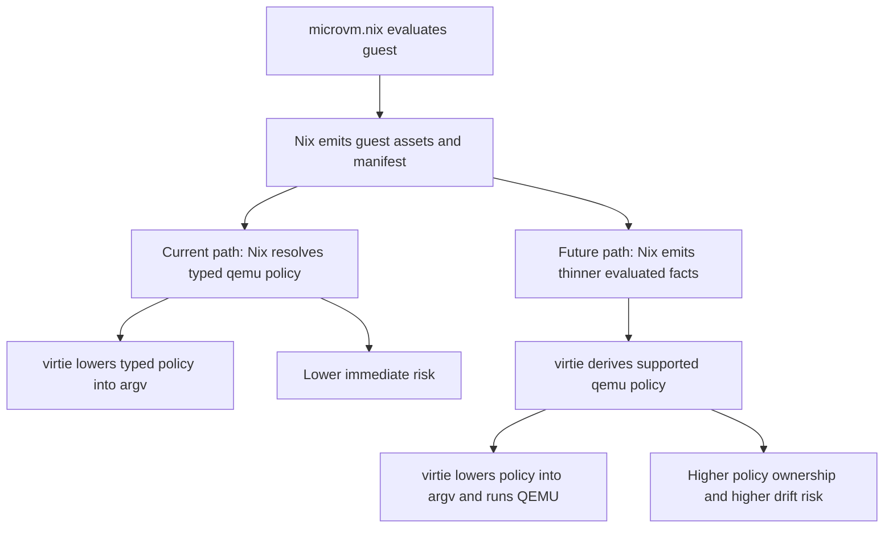

# Virtie MicroVM Policy

Future refactor to move host-side microvm-to-QEMU policy ownership from Nix into `virtie`.

**Status**: Planning Phase

## Goals

Evaluate a future boundary where `virtie` owns not just final argv lowering, but also the host-side policy currently encoded in `agentspace-qemu-config.nix`.

- Remove `agentspace-qemu-config.nix` as a distinct ownership boundary, not merely by inlining it elsewhere in Nix.
- Keep `microvm.nix` responsible for guest evaluation and image or artifact production.
- Replace the current fully resolved `qemu` manifest section with a thinner manifest that carries only the evaluated facts `virtie` cannot rediscover locally.
- Make `virtie` compute the currently supported host-side QEMU policy for the admitted surface: machine defaults, transport choice, kernel console params, block-device naming, network forwarding, memory backend selection, and similar launch-time decisions.
- Preserve the current supported launch UX and behavior: `virtiofs + ssh + qemu`, foreground-only, with dynamic vsock CID allocation.
- Prove behavioral parity before removing the current Nix-owned policy path.

Out of scope:

- deleting the separate file by simply inlining its contents into `sandbox-qemu.nix`
- broadening the supported launcher surface beyond the current admitted path
- moving guest image construction, initrd generation, or kernel builds out of Nix
- restoring console attach, `9p`, airlock, bridge or tap networking, graphics, or passthrough support as part of this refactor
- changing the user-facing `virtie launch <manifest>` CLI

Acceptance criteria:

- [ ] `agentspace-qemu-config.nix` is removed and not replaced with an equivalent large policy builder elsewhere in Nix.
- [ ] The manifest contract no longer embeds a fully resolved `qemu` section; instead it carries a thinner set of evaluated microvm facts, runtime paths, and capability flags needed by `virtie`.
- [ ] `virtie` computes the currently supported host-side QEMU policy for the admitted surface and produces the same effective QEMU invocation as the current typed-manifest path.
- [ ] A parity suite compares the future `virtie`-owned policy path against the current implementation for representative configs: default sandbox, serial console enabled, forward ports configured, CPU or machine overrides, balloon enabled, and `microvm.qemu.extraArgs`.
- [ ] Repo-level Nix checks cover the thinner manifest contract and the end-to-end launch path.
- [ ] `.specs/agentspace.md` and `.specs/virtie.md` are updated so the Nix-to-`virtie` ownership boundary is unambiguous.

## Progress

- [x] Move final QEMU argv construction out of Nix and into `virtie`.
- [x] Keep Nix responsible for guest evaluation and for emitting a fully resolved typed `qemu` manifest through `agentspace-qemu-config.nix`.
- [x] Re-establish contract and E2E checks around the current typed-manifest path so future parity work has a stable baseline.
- [ ] Decide the target manifest boundary: "raw evaluated microvm facts" versus "minimal resolved launch facts".
- [ ] Inventory every policy decision currently encoded in `agentspace-qemu-config.nix` and classify whether it should stay Nix-owned, move to `virtie`, or be represented as a capability flag from Nix.
- [ ] Design the thinner manifest schema and versioning story.
- [ ] Build a parity oracle so the current typed-manifest implementation can validate the future `virtie`-owned policy compiler.
- [ ] Teach `virtie` to derive the supported QEMU policy from the thinner manifest.
- [ ] Remove `agentspace-qemu-config.nix` and update the launcher documentation and checks.

## Appendix

- Current Nix-owned policy areas in `agentspace-qemu-config.nix`:
  - host-platform-derived acceleration and machine defaults
  - transport selection based on machine type and share usage
  - CPU defaulting and `enableKvm` policy
  - kernel console parameter construction
  - memory backend selection for shared-memory `virtiofs`
  - QMP socket defaulting
  - balloon defaults
  - block-device IDs, AIO engine, cache policy, and serial propagation
  - user-network forwarding lowering, ROM-file policy, and MQ vector calculation
  - passthrough of `microvm.qemu.extraArgs`
- Recommended direction if this work is pursued:
  - Do not mirror raw `microvm` options one-for-one in Go.
  - Prefer a thinner manifest that preserves evaluated facts from Nix, especially store paths and package or platform capability data, while moving policy composition into `virtie`.
  - Keep package-dependent capability facts Nix-owned where `virtie` cannot reliably infer them, such as whether the selected QEMU package was built with seccomp support.
- Risks to keep visible:
  - policy drift between `microvm.nix` and `virtie`
  - under-specifying host capability inputs that Go cannot rediscover from the Nix store
  - turning the manifest into a second unstable copy of `microvm` configuration rather than a stable launcher contract
  - weakening the current clear ownership split just to eliminate one helper file
- Open questions:
  - Which values should remain explicit manifest inputs even in the future path: QEMU binary path, kernel path, initrd path, seccomp capability, `virtiofsd` commands, volume image paths?
  - Should `virtie` own default QMP socket path selection, or should Nix continue to provide it so wrapper behavior stays fully explicit?
  - Should device IDs and block letters become `virtie` policy, or remain part of the manifest to minimize guest-visible naming drift?
  - Is the right long-term contract a `microvm` facts section, a thinner `qemuPolicy` section, or another shape entirely?
- Scope reminder:
  - If the only goal is to remove a file, inline `agentspace-qemu-config.nix` into `sandbox-qemu.nix` instead.
  - This spec is only justified if we want to change ownership of the host-side launch policy itself.

