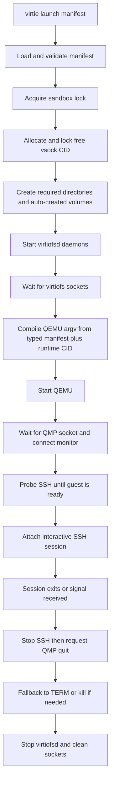

# Virtie

Host-side process manager for the supported agentspace sandbox launch path.

**Status**: In-Progress

## Goals

Provide the foreground launch runtime for the supported sandbox session created by Nix.

- Load and validate a Nix-generated manifest for the supported sandbox workflow.
- Allocate and lock a runtime vsock CID for each session.
- Create missing auto-created volume images, start `virtiofsd`, launch QEMU directly, wait for SSH readiness, and attach the active SSH session.
- Keep a long-lived QMP session open after boot for graceful shutdown and optional runtime balloon control.
- Tear down SSH, QEMU, and `virtiofsd` in the correct order on exit or signal.
- Surface stage-specific failures clearly enough to debug preflight, startup, readiness, session, and teardown problems.

Out of scope:

- reconnect support
- alternate guest attach or share workflows beyond the supported SSH + `virtiofs` path
- `systemd --user`, `journalctl`, or machined integration
- bridge, tap, macvtap, graphics, or passthrough workflows
- full `microvm-run` parity

Acceptance criteria:

- [x] `virtie launch <manifest> [-- <remote-cmd...>]` is the supported user-facing command.
- [x] Manifest validation enforces the implemented typed QEMU contract for host name, working dir, lock path, ssh argv/user, QMP socket, QEMU devices, `virtiofs` daemons, and auto-created volumes.
- [x] QEMU launch is compiled from the typed manifest plus the runtime-selected CID rather than string-substituting a Nix-generated argv template.
- [x] Launch acquires per-sandbox and per-CID locks before starting guest processes.
- [x] Launch waits for `virtiofs` socket readiness, then QMP readiness, then retries SSH probes before starting the interactive session.
- [x] Teardown stops the foreground SSH session first, then requests QMP `quit`, then falls back to signal-based QEMU shutdown, then stops `virtiofsd`.
- [x] Repo-level Nix checks exercise the generated wrapper and E2E launch path by default.

## Progress

- [x] Implement manifest loading, validation, defaulting, and path resolution.
- [x] Replace `qemu.argvTemplate` with a typed `qemu` manifest contract that captures the resolved host-side launch inputs.
- [x] Implement QEMU argv compilation inside `virtie`, using `govmm/qemu` for typed device emission where it fits and local raw-arg assembly for user networking, memfd memory, balloon flags, and block-device details that are not modeled cleanly.
- [x] Implement QMP connection management with `go-qemu/qmp` for monitor readiness and graceful `quit` during teardown.
- [x] Extend the QMP session to use `go-qemu/qmp/raw` for `query-balloon`, `balloon`, `qom-set`, `qom-get`, and `qom-list` so runtime balloon control can share the same monitor connection as shutdown.
- [x] Implement launch sequencing for preflight, `virtiofs` socket wait, QMP readiness, QEMU start, SSH readiness probing, session attach, and ordered shutdown.
- [x] Start an optional guest-pressure balloon controller only after SSH readiness succeeds, and stop it before sending the final QMP `quit`.
- [x] Implement volume auto-create handling, including filesystem defaults and `mkfs.<fsType>` execution.
- [x] Implement per-sandbox and per-CID lock files for concurrent session safety.
- [x] Add runtime-dir-based socket resolution for relative QMP and `virtiofs` sockets, using XDG defaults when requested by the manifest.
- [x] Implement stage-aware errors and foreground SSH exit-code propagation.
- [x] Cover manifest validation, typed QEMU compilation, CID locking, QMP shutdown, SSH retry behavior, and launch/teardown ordering with Go tests.
- [x] Confirm `CGO_ENABLED=0 go test ./...` passes in `virtie`.
- [x] Keep the launch-contract and fake-tools E2E Nix checks enabled in the default repo check surface.

## Appendix

- Current manifest contract:
  - `identity.hostName`
  - `paths.workingDir`
  - `paths.lockPath`
  - optional `paths.runtimeDir`
  - `persistence.directories`
  - `ssh.argv`
  - `ssh.user`
  - `qemu.binaryPath`
  - `qemu.name`
  - `qemu.machine`
  - `qemu.cpu`
  - `qemu.memory`
  - `qemu.kernel`
  - `qemu.smp`
  - `qemu.console`
  - `qemu.knobs`
  - `qemu.qmp.socketPath`
  - `qemu.devices.rng`
  - `qemu.devices.balloon`
  - optional `qemu.devices.balloon.controller`
  - `qemu.devices.virtiofs[]`
  - `qemu.devices.block[]`
  - `qemu.devices.network[]`
  - `qemu.devices.vsock`
  - `qemu.machineId`
  - `qemu.passthroughArgs`
  - `volumes[].imagePath`, `sizeMiB`, `fsType`, `autoCreate`, optional `label`, `mkfsExtraArgs`
  - `virtiofs.daemons[].socketPath`
  - `virtiofs.daemons[].command`
  - optional `vsock.cidRange`, defaulting to `3..65535`
- Runtime assumptions:
  - Nix has already produced the guest image inputs, resolved host-side QEMU settings, and manifest.
  - `ssh` and the required `mkfs.<fsType>` tools are available on the host.
  - The guest SSH service is reachable over the runtime-selected vsock CID.
- Runtime socket policy:
  - If `paths.runtimeDir` is omitted, relative socket paths still resolve from `paths.workingDir`.
  - If `paths.runtimeDir` is the empty string, `virtie` resolves relative socket paths under the per-user XDG runtime location at `agentspace/<hostName>/...`.
  - `virtie` injects `VIRTIE_SOCKET_PATH` for each `virtiofsd` daemon process so launch scripts can consume the resolved socket path.
- Implementation notes:
  - `govmm/qemu` is used as a typed device-argument helper, not as the process launcher.
  - QMP is used for monitor readiness, graceful shutdown, and optional runtime balloon control, not for guest readiness.
  - When `qemu.devices.balloon` is present, `virtie` resolves the balloon QOM path, enables `guest-stats-polling-interval`, reads `guest-stats` plus `query-balloon`, and adjusts the logical guest memory size within configured or synthesized bounds.
  - If the manifest omits `qemu.devices.balloon.controller`, `virtie` defaults to `maxActualMiB = qemu.memory.sizeMiB`, an idle reclaim target of 50% of that max, a grow threshold at 25% available memory, and the existing step, poll, and reclaim-holdoff defaults.
  - The old Nix-owned argv-template path has been removed from the active contract.
- Current verification note: the Go package tests pass, and `checks/default.nix` keeps the launch-contract and fake-tools E2E coverage enabled alongside repo-level hook-compatibility checks.

