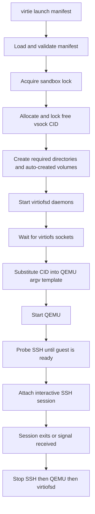

# Virtie

Host-side process manager for the supported agentspace sandbox launch path.

**Status**: In-Progress

## Goals

Provide the foreground launch runtime for the supported sandbox session created by Nix.

- Load and validate a Nix-generated manifest for the supported sandbox workflow.
- Allocate and lock a runtime vsock CID for each session.
- Create missing auto-created volume images, start `virtiofsd`, launch QEMU directly, wait for SSH readiness, and attach the active SSH session.
- Tear down SSH, QEMU, and `virtiofsd` in the correct order on exit or signal.
- Surface stage-specific failures clearly enough to debug preflight, startup, readiness, session, and teardown problems.

Out of scope:

- reconnect support
- console attach
- `9p` support
- airlock setup or cleanup
- `systemd --user`, `journalctl`, or machined integration
- bridge, tap, macvtap, graphics, or passthrough workflows
- full `microvm-run` parity

Acceptance criteria:

- [x] `virtie launch <manifest> [-- <remote-cmd...>]` is the supported user-facing command.
- [x] Manifest validation enforces the implemented contract for host name, working dir, lock path, ssh argv/user, QEMU argv template, `virtiofs` daemons, and auto-created volumes.
- [x] QEMU launch substitutes the runtime CID into the literal `{{VSOCK_CID}}` placeholder.
- [x] Launch acquires per-sandbox and per-CID locks before starting guest processes.
- [x] Launch waits for `virtiofs` socket readiness and retries SSH probes before starting the interactive session.
- [x] Teardown stops the foreground SSH session first, then QEMU, then `virtiofsd`.
- [ ] Repo-level Nix checks exercise the generated wrapper and E2E launch path by default.

## Progress

- [x] Implement manifest loading, validation, defaulting, and path resolution.
- [x] Implement launch sequencing for preflight, socket wait, QEMU start, SSH readiness probing, session attach, and ordered shutdown.
- [x] Implement volume auto-create handling, including filesystem defaults and `mkfs.<fsType>` execution.
- [x] Implement per-sandbox and per-CID lock files for concurrent session safety.
- [x] Implement stage-aware errors and foreground SSH exit-code propagation.
- [x] Cover manifest validation, CID substitution, CID locking, SSH retry behavior, and launch/teardown ordering with Go tests.
- [x] Confirm `go test ./...` passes in `virtie`.
- [ ] Keep the Nix-layer integration checks enabled and green as part of the default repo check surface.

## Appendix

- Current manifest contract:
  - `identity.hostName`
  - `paths.workingDir`
  - `paths.lockPath`
  - `persistence.directories`
  - `ssh.argv`
  - `ssh.user`
  - `qemu.argvTemplate`
  - `volumes[].imagePath`, `sizeMiB`, `fsType`, `autoCreate`, optional `label`, `mkfsExtraArgs`
  - `virtiofs.daemons[].socketPath`
  - `virtiofs.daemons[].command`
  - optional `vsock.cidRange`, defaulting to `3..65535`
- Runtime assumptions:
  - Nix has already produced the guest image inputs and manifest.
  - `ssh` and the required `mkfs.<fsType>` tools are available on the host.
  - The guest SSH service is reachable over the runtime-selected vsock CID.
- Current verification note: the Go package tests pass, but the repo does not currently enable all Nix checks that were intended to cover the launch wrapper and fake-tools E2E path.

