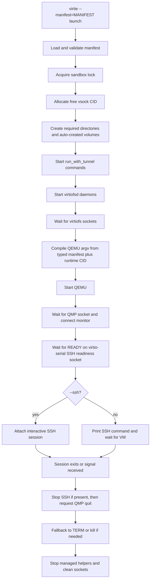

# Virtie

Host-side process manager for the supported agentspace sandbox launch path.

**Status**: Completed

## Goals

Provide the foreground launch runtime for the supported sandbox session created by Nix.

- Load and validate a Nix-generated manifest for the supported sandbox workflow.
- Allocate a runtime vsock CID for each session.
- Create missing auto-created volume images, start `virtiofsd`, launch QEMU directly, wait for SSH readiness, and either print out-of-band SSH instructions or attach the active SSH session when requested.
- Keep a long-lived QMP session open after boot for graceful shutdown and optional runtime balloon control.
- Support disk-backed suspend/resume by saving QEMU migration state to disk and restoring it later.
- Tear down SSH, QEMU, and `virtiofsd` in the correct order on exit or signal.
- Surface stage-specific failures clearly enough to debug preflight, startup, readiness, session, and teardown problems.

Out of scope:

- full hibernation restore from RAM and device state
- reconnect support
- alternate guest attach workflows beyond the supported SSH path
- `systemd --user`, `journalctl`, or machined integration
- bridge, tap, macvtap, display protocols beyond local GTK/Cocoa graphics, or passthrough workflows
- full `microvm-run` parity

Acceptance criteria:

- [x] `virtie --manifest=MANIFEST [-v|-vv] launch [--ssh] [--resume=no|auto|force] [-- <remote-cmd...>]` is the supported launch command. Shared options may also be placed after the subcommand.
- [x] `virtie --manifest=MANIFEST suspend` saves QEMU migration state to disk, records saved suspend state, and exits the launch session. Shared options may also be placed after the subcommand.
- [x] `virtie --manifest=MANIFEST [-v|-vv] launch --resume=force` restores only from saved suspend state. Shared options may also be placed after the subcommand.
- [x] Manifest validation enforces the implemented typed QEMU contract for host name, working dir, lock path, ssh argv/user, QMP socket, SSH readiness socket, QEMU devices, `virtiofs` daemons, opt-in `9p` shares, and auto-created volumes.
- [x] QEMU launch is compiled from the typed manifest plus the runtime-selected CID rather than string-substituting a Nix-generated argv template.
- [x] Launch acquires the per-sandbox lock and probes free vsock CIDs before starting guest processes.
- [x] Launch waits for `virtiofs` socket readiness, then QMP readiness, then guest-pushed SSH readiness over virtio-serial before printing SSH instructions or starting the interactive session.
- [x] Teardown stops the foreground SSH session when present, then requests QMP `quit`, then falls back to signal-based QEMU shutdown, then stops `virtiofsd`.
- [x] Repo-level Nix checks exercise the generated wrapper and E2E launch path by default.
- [x] Graphical QEMU launch manifests can opt out of `-nographic` and request the supported GTK or Cocoa display backend.

## Progress

- [x] Implement manifest loading, validation, defaulting, and path resolution.
- [x] Replace `qemu.argvTemplate` with a typed `qemu` manifest contract that captures the resolved host-side launch inputs.
- [x] Replace the resolved `qemu` manifest contract with launch facts and move host-side QEMU policy derivation into `virtie`.
- [x] Implement QEMU argv compilation inside `virtie`, using `govmm/qemu` for typed device emission where it fits and local raw-arg assembly for user networking, memfd memory, balloon flags, and block-device details that are not modeled cleanly.
- [x] Implement QMP connection management with `go-qemu/qmp` for monitor readiness and graceful `quit` during teardown.
- [x] Extend the QMP session to use `go-qemu/qmp/raw` for `query-balloon`, `balloon`, `qom-set`, `qom-get`, and `qom-list` so runtime balloon control can share the same monitor connection as shutdown.
- [x] Implement launch sequencing for preflight, `virtiofs` socket wait, QMP readiness, QEMU start, virtio-serial SSH readiness, session attach, and ordered shutdown.
- [x] Start an optional guest-pressure balloon controller only after SSH readiness succeeds, and stop it before sending the final QMP `quit`.
- [x] Start optional `run_with_tunnel` host commands that produce Unix sockets under the state tunnel directory and keep them under the managed launch lifecycle.
- [x] Implement volume auto-create handling, including filesystem defaults and native ext4 image creation.
- [x] Implement the per-sandbox lock file for concurrent session safety.
- [x] Add runtime-dir-based socket resolution for relative QMP, SSH readiness, QGA, and `virtiofs` sockets, using XDG defaults when requested by the manifest.
- [x] Allow the Nix store `virtiofs` share to target a provided host socket while `virtie` only starts and removes sockets listed under `virtiofs.daemons`.
- [x] Add opt-in `qemu.devices.9p[]` support, resolving relative host source paths from `paths.workingDir` and translating them to QEMU `-fsdev local` plus `virtio-9p-*` devices.
- [x] Implement stage-aware errors and foreground SSH exit-code propagation.
- [x] Add explicit launch signal handling for interrupt/terminate teardown.
- [x] Add disk-backed suspend/resume commands and saved suspend state records under `paths.workingDir/.virtie`.
- [x] Route suspend through a caught `SIGTSTP` control signal so the launch process saves state through its owned QMP session, then exits.
- [x] Replace the separate `virtie resume` command with `virtie launch --resume=no|auto|force` so fresh and restored sessions share one lifecycle.
- [x] Print launch lifecycle stats after shutdown, including start-to-boot, boot-to-SSH-session when attached, shutdown completion, and total duration.
- [x] Print guest process diagnostics on `SIGUSR1` by collecting process-list output through QGA `guest-exec`.
- [x] Replace SSH autoconnect retry probing with a guest-pushed `READY` signal over the `virtie.ssh.ready` virtio-serial port.
- [x] Cover manifest validation, typed QEMU compilation, CID allocation, QMP shutdown, SSH readiness behavior, and launch/teardown ordering with Go tests.
- [x] Confirm `CGO_ENABLED=0 go test ./...` passes in `virtie`.
- [x] Keep the launch-contract and fake-tools E2E Nix checks enabled in the default repo check surface, including saved suspend/resume coverage.
- [x] Add typed graphical display compilation for `gtk` and `cocoa` manifest backends.
- [x] Add JSON and TOML decoding for the manifest, with Nix-generated manifests remaining JSON.
- [x] Add `run_with_tunnel` manifest decoding, template rendering, concurrent startup, and lifecycle monitoring.

## Appendix

- Current public manifest contract:
  - `virtie` accepts the supported snake_case manifest shape as TOML for human-authored manifests and JSON for generated wrappers.
  - Top-level identity and path fields are `host_name`, `working_dir`, and `state_dir`.
  - `qemu` contains `exec`, optional `fwd_tunnel_exec`, optional `user`, `seccomp`, `machine_options`, `qmp_socket`, and `guest_agent_socket`; QEMU is the only implemented backend.
  - `machine` contains `type`, optional `id`, `memory`, optional `vcpu`, optional `cpu`, and `kvm`; `kernel` contains `path`, `initrd_path`, optional `params`, and `serial_console`.
  - Optional `graphics.backend` supports `headless`, `gtk`, and `cocoa`. Graphical GTK launches emit `-display gtk,gl=off`, `virtio-vga`, `qemu-xhci`, `usb-tablet`, and `usb-kbd`; Cocoa launches emit `-display cocoa`, `virtio-gpu`, `qemu-xhci`, `usb-tablet`, and `usb-kbd`.
  - `ssh` contains `exec`, `user`, optional `ready_socket`, optional `retry_delay`, and optional `autoprovision`.
  - Optional `vsock.cid_range` defaults to the allocatable CID range `3..65535`.
  - Optional `run_with_tunnel[]` entries contain `socket`, `exec`, and optional string `vars`; `socket` is relative to `<state_dir>/tunnels` on the host and `/run/tunnels` in the guest.
  - `mounts[]` is an ordered tagged union. `type = "virtiofs"` and `type = "9p"` entries describe shares; `type = "image"` entries describe block images with `image.size`, `image.fs`, `image.create`, optional `image.label`, `image.direct`, and optional `image.serial`. Auto-created images are ext4 only and require `size >= 256`.
  - Managed `virtiofsd` commands use `virtiofs.bin`/`virtiofs.args`, and `virtie` injects the resolved socket path as `VIRTIOFSD_SOCKET`.
  - For `microvm`, `virtiofs` and `9p` share mounts require PCI transport, but image mounts do not; image-only microvms remain on MMIO unless graphics or another PCI-only feature is enabled.
  - `networks[]` describe user networking and `forward[]` host-to-guest or guest-to-host port forwards.
  - Optional `balloon` contains device facts and controller policy; optional `write_files[]` contains `guest_path`, exactly one of `text` or `source`, optional `chown`, optional mode, and `overwrite`; optional `notifications.exec` and `notifications.states` define best-effort host hooks.
  - Manifest exec arrays render Go `text/template` values per argv element. Commands that `virtie` starts directly also receive the same context through uppercase environment variables, and the host process environment is available under `.Env`. `qemu.exec` renders during manifest resolution with `HostName`, `WorkingDir`, `StateDir`, `HostOS`, `HostArch`, `HostSystem`, and `.Env`, but does not receive injected environment variables because it is resolved into QEMU binary and passthrough args. `qemu.fwd_tunnel_exec` is rendered per guest forward but does not receive injected environment variables because QEMU starts those commands directly.
- Runtime assumptions:
  - An upstream producer has already produced the guest image inputs, package paths, host facts, and manifest.
  - `virtie` treats the manifest as a Nix-agnostic runtime contract; Nix and microvm.nix option semantics must be resolved into launch facts before this boundary.
  - An omitted `[graphics]` section and `graphics.backend = "headless"` both represent the normal headless SSH workflow.
  - QEMU fields are validated only when `virtie` must interpret them before launch, such as transport selection or virtiofs socket waits. Values passed directly into QEMU args are allowed through so QEMU reports invalid inputs.
  - `ssh` is available on the host.
  - The guest writes `READY` to `/dev/virtio-ports/virtie.ssh.ready` after `sshd.service` is started.
  - The guest SSH service is reachable over the runtime-selected vsock CID after the readiness signal is received.
- Runtime socket policy:
  - If `paths.runtimeDir` is omitted, relative socket paths still resolve from `paths.workingDir`.
  - If `paths.runtimeDir` is the empty string, `virtie` resolves relative socket paths under the per-user XDG runtime location at `agentspace/<hostName>/...`.
  - `virtie` injects `VIRTIOFSD_SOCKET` for each `virtiofsd` daemon process so launch scripts can consume the resolved socket path.
  - `virtie launch` records its PID at `<workingDir>/.virtie/<hostName>.pid` after acquiring the sandbox lock and removes that file during teardown.
- Implementation notes:
  - `govmm/qemu` is used as a typed device-argument helper, not as the process launcher.
  - QMP is used for monitor readiness, graceful shutdown, disk-backed suspend/resume, and optional runtime balloon control, not for SSH readiness.
  - `virtie launch --resume=no` is the default fresh launch mode.
  - `virtie launch --ssh` attaches SSH; without `--ssh`, launch still drains SSH readiness, then prints the SSH command and waits for VM exit or suspend.
  - `virtie launch --resume=auto` restores saved state when valid state is present and otherwise launches fresh.
  - `virtie launch --resume=force` requires saved suspend state and errors if it is absent or invalid.
  - `virtie suspend` validates the launch PID and sends `SIGTSTP` as an internal control signal; `virtie launch` catches it, saves migration state through the existing QMP session, then exits.
  - Live pause/resume, terminal job-control suspend, and `SIGCONT` resume are not supported.
  - `virtie launch` writes final shutdown stats after teardown and cleanup complete; non-SSH launches omit the SSH-session interval. Verbose package logs use stdlib `log/slog` text records on stderr, with package identity carried as an attribute such as `package=manager`.
  - `run_with_tunnel` commands run with `<state_dir>/tunnels` as the working directory. Command templates receive `Socket`, `GuestSocket`, optional `vars`, and `.Env`; commands receive matching uppercase environment variables.
  - `SIGUSR1` asks a running launch process to collect guest info through the configured QGA socket. The current info payload is raw `ps -eo pid,ppid,stat,comm,args` output; collection failures are logged and do not affect the VM lifecycle.
  - Fresh launches consume the exact `READY` token over the SSH readiness socket regardless of SSH autoconnect; startup fails if QEMU exits first, the token is wrong, or the readiness timeout expires.
  - When `qemu.devices.balloon` is present, `virtie` resolves the balloon QOM path, enables `guest-stats-polling-interval`, reads `guest-stats` plus `query-balloon`, and adjusts the logical guest memory size within configured or synthesized bounds.
  - If the manifest omits `qemu.devices.balloon.controller`, `virtie` defaults to `maxActualMiB = qemu.memory.sizeMiB`, an idle reclaim target of 50% of that max, a grow threshold at 25% available memory, and the existing step, poll, and reclaim-holdoff defaults.
  - Notification hooks are best-effort and never fail launch, suspend, resume, teardown, or balloon control.
  - Current notification states are `runtime:suspend` after saved suspend state is written, `runtime:resume` after restore migration and QMP `cont` succeed, and `balloon:resize` after a balloon resize succeeds.
  - Notification commands receive `VIRTIE_NOTIFY_STATE`, `VIRTIE_NOTIFY_MESSAGE`, and `VIRTIE_NOTIFY_CONTEXT_<UPPER_SNAKE_KEY>` environment variables. Command args are rendered as templates using original context keys, then passed without shell word-splitting.
  - The old Nix-owned argv-template path has been removed from the active contract.
  - When `qemu.knobs.noGraphic` is false and `qemu.graphics.backend` is set, `virtie` emits the local QEMU display device set for `gtk` or `cocoa` instead of `-nographic`.
  - Future manifest/runtime improvements to keep visible: replace guest-to-host `guestfwd cmd:` translation with QEMU-native forwarding or chardev handling if QEMU grows a better fit, and revisit whether headless graphics should remain both explicit and representable by omission.
- Current verification note: the Go package tests pass, and `checks/default.nix` keeps the launch-contract and fake-tools E2E coverage enabled alongside repo-level hook-compatibility checks.

