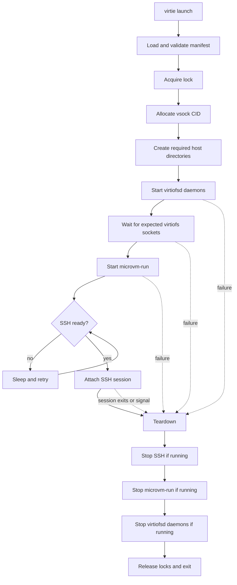

# Virtie Specification

## Purpose

`virtie` is the host-side process manager for one interactive sandbox workflow:

- start one `virtiofsd` process per configured share
- start `microvm-run`
- connect to the guest over SSH as part of launch
- tear everything down cleanly on exit

V1 is intentionally narrow. It replaces the current shell-plus-`systemd-run` orchestration for the `virtiofs + ssh` path only.

Nix remains the source of truth for:

- guest configuration
- generated helper binaries such as `microvm-run`
- generated `virtiofsd` command lines for each share
- launch metadata passed to `virtie`

`virtie` does not construct QEMU or `virtiofsd` argv in v1.

## Assumptions

V1 assumes all of the following:

- connection is always over SSH
- file sharing is always `virtiofs`
- airlock behavior is out of scope
- `virtie` runs in the foreground
- one `virtie` process manages one sandbox session
- there is no reconnect command in v1

Anything outside this path is deferred until later.

## Non-Goals

- console support
- `9p` support
- airlock setup or cleanup
- reconnect support
- replacing `mkSandbox` as the public Nix API
- rewriting `microvm-run`
- running as a background daemon

## User-Facing Command

### `virtie launch <manifest> [-- <remote-cmd...>]`

Starts and manages one sandbox session.

Behavior:

1. load and validate the manifest
2. acquire a per-sandbox lock
3. allocate and lock a free vsock CID from the configured range
4. create required host directories
5. start the configured `virtiofsd` daemons
6. wait for the expected virtiofs socket paths to exist
7. start `microvm-run`
8. retry SSH until the guest is ready
9. attach the SSH session to the current terminal
10. on exit or signal, stop SSH first, then the VM, then the `virtiofsd` daemons

## Manifest Contract

Nix generates a JSON manifest consumed by `virtie`.

V1 only needs fields for the single supported workflow:

- identity:
  - `hostName`
- paths:
  - `workingDir`
  - `microvmRun`
  - `lockPath`
- persistence:
  - host directories that must exist before launch
- ssh:
  - SSH argv template with fixed options only
  - SSH user
- vsock:
  - optional CID allocation range override
- virtiofs:
  - per-share daemon commands and expected socket paths that must exist before starting the VM

The manifest does not need console, `9p`, or airlock fields in v1.

## Command Inventory

This inventory reflects the specific workflow visible in `flake.nix`, `sandbox-qemu.nix`, and the generated launch manifest.

### Commands `virtie` must replace directly

| Current command | Purpose | `virtie` v1 handling |
| --- | --- | --- |
| `systemctl --user is-active "$name_prefix-*.service"` | reject duplicate active launches | replace with an explicit lock check |
| `systemctl --user reset-failed "$name_prefix-*.service"` | clear transient unit failure state | no direct equivalent |
| `systemd-run --user ... "$RUNNER_PATH/bin/virtiofsd-run"` | supervise the old virtiofs helper | removed; spawn `virtiofsd` children directly |
| `systemd-run --user ... "$RUNNER_PATH/bin/microvm-run"` | supervise the VM process | spawn child directly |
| `journalctl --user --no-pager -u "$vm_unit.service" --invocation=0` | inspect VM logs | replace with direct child stdout/stderr streaming |
| `systemd-run --user --wait --pty ... ssh ... "$@"` | retry until SSH is ready, then attach | run SSH with retry/backoff in Go |
| `systemctl --user stop ...` | stop transient units on exit | terminate tracked children directly |

### Commands still executed, but launched by `virtie`

| Command | Why it still exists in v1 |
| --- | --- |
| `virtiofsd` | launched from Nix-generated per-share commands |
| `microvm-run` | Nix-generated VM launcher remains the source of truth |
| `ssh` | SSH is the only supported connection mechanism; `virtie` fills in the runtime vsock destination |

### Subprocesses hidden behind helpers

| Command | Current source | Why it matters |
| --- | --- | --- |
| `qemu-system-*` | spawned by `microvm-run` | main VM workload managed indirectly through `microvm-run` |
| `virtiofsd --socket-path=...` | spawned directly by `virtie` from manifest commands | serves the `ro-store` and `workspace` shares |

### Structured host operations

These should be normal Go operations, not shell:

- create required host directories before launch
- wait for expected virtiofs sockets before starting the VM
- hold a lock for duplicate-launch prevention

## Runtime Dependencies

### Required for the current workflow

| Dependency | Needed for |
| --- | --- |
| `openssh` client | guest connection over SSH |
| `microvm-run` binary | VM startup |
| `virtiofsd` | serving `virtiofs` shares |
| QEMU / microvm runtime | actual guest execution |
| vsock support | SSH-over-vsock transport |
| writable filesystem paths | lock path, sockets, image paths |
| KVM when available | accelerated VM execution |

### Runtime assumptions for `virtie`

`virtie` should assume:

- Nix has already produced valid helper binaries and a manifest
- the host can access the configured image and socket paths
- the guest SSH service is configured and reachable over the runtime-selected vsock CID
- if the manifest does not specify a vsock range, `virtie` allocates from `3..65535`

`virtie` should not assume:

- `systemd --user` is available
- `journalctl` is available
- console attach behavior exists

## Process Model

The only supported v1 process flow is:

1. preflight and lock acquisition
2. allocate and lock a free vsock CID
3. start the configured `virtiofsd` daemons
4. wait for the expected virtiofs sockets
5. start `microvm-run` with the selected CID injected at runtime
6. retry SSH until the guest is ready
7. attach the SSH session
8. on exit, stop SSH, then VM, then the `virtiofsd` daemons

### Control Flow Diagram

Any failure after a child process has started follows the same teardown path.

## Logging And Errors

`virtie` should:

- forward child stdout/stderr directly to the terminal
- identify which stage failed: preflight, virtiofs startup, VM startup, SSH readiness, active session, teardown
- return the foreground SSH exit status when possible

## State And Locking

`virtie` needs:

- a per-sandbox lock file to prevent duplicate launches
- a per-CID lock file to keep concurrent sessions from choosing the same vsock CID

There is still no reconnect state in v1.

## Testing Requirements

`virtie` needs:

- unit tests for manifest validation
- unit tests for the launch sequence and teardown ordering
- unit tests for SSH retry behavior
- integration coverage that exercises the generated launch wrapper for the `virtiofs + ssh` path
